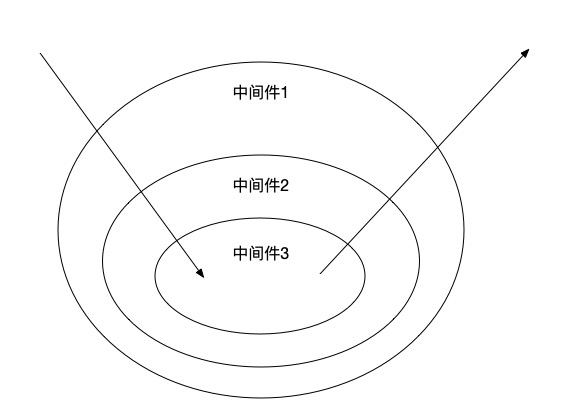

# compose  

## koa-compose  
`koa-compose` 其实就是一种串行处理中间件的方式，并且可以通过 `async/await` 来控制各个中间件的执行流程，这就是典型的洋葱模型。  

下面是一个 ”洋葱模型“ 的案例   
```javascript
const middleware1 = ( ctx, next ) => {
    console.log( 'step1 start.' );
    await next();
    console.log( 'step1 end.' );
}

const middleware2 = ( ctx, next ) => {
    console.log( 'step2 start.' );
    await next();
    console.log( 'step2 end.' );
}

const middleware3 = ( ctx, next ) => {
    console.log( 'step3 start.' );
    await next();
    console.log( 'step3 end.' );
}

compose( SyncMiddleware1, SyncMiddleware2, SyncMiddleware3 )({});
```   

上面的代码会输出  
```javascript
// step1 start.
// step2 start.
// step3 start.
// step3 end.
// step2 end.
// step1 end.
```  

可以看到，当执行到 `await next()` 的时候，首先会去处理下一个中间件，等到下一个中间件处理完成后，再回到当前中间件，继续处理之后的任务。  

这就是典型的洋葱模型，如图，由外层逐渐向里层，然后再一层一层出来  

  

### 实现 koa-compose   
首先从上面的例子中可以看出以下几点  
1. `compose` 的参数是一系列的中间件  
2. `compose` 返回一个新的函数，新的函数接受一个作用域参数，即每个中间件的 `ctx` 参数  
3. 中间件必须是函数，且可以接受两个参数，作用域对象 `ctx` 和执行下一个中间件的回调 `next`   
4. 因为我们不知道总共有几个中间件，所以必须手动调用 `next` 方法来保证后续的中间件能被执行  
5. 默认会调用第一个中间件   

#### 版本一  

```javascript
function compose ( ...middlewares ) {
    return function ( ctx ) {
        function dispatch ( index ) {
            // 获取当前的中间件
            const middleware = middlewares[index];
            // 执行中间件，并传入作用域对象 ctx 和 dispatch 方法，并且 dispatch 方法的参数会自动 + 1
            // 这样，在中间件里我们调用 next 的时候就不需要传参数，就会执行下一个中间件了
            middleware( ctx, dispatch.bind( null, index + 1 ) );
        }

        // 默认执行第一个中间件
        dispatch( 0 );
    }
}
```  

这是一个最简易的 `compose` 实现，先来测试下  

```javaascript
compose( Middleware1, Middleware2, Middleware3 )({});
```    

运行上面代码会报错  
```javascript
TypeError: middleware is not a functions
```   

是因为在最后一个中间件里仍然执行了 `next` 方法，导致在中间件数组 `middlewares` 越界了，所以我们需要判断是否已经运行到最后一个中间件。  

#### 版本二  

```javascript
function compose ( ...middlewares ) {
    return function ( ctx ) {
        function dispatch ( index ) {
            // 检测是否已经执行到最后一个中间件
            if ( middlewares.length === index ) {
                return ;
            }

            // 获取当前的中间件
            const middleware = middlewares[index];
            // 执行中间件，并传入作用域对象 ctx 和 dispatch 方法，并且 dispatch 方法的参数会自动 + 1
            // 这样，在中间件里我们调用 next 的时候就不需要传参数，就会执行下一个中间件了
            middleware( ctx, dispatch.bind( null, index + 1 ) );
        }

        // 默认执行第一个中间件
        dispatch( 0 );
    }
}
```  

上面代码会输如下，`undefined` 先不用管，后续会说到  
```javascript
// Sync Middleware1 start.
// Sync Middleware2 start.
// Sync Middleware3 start.
// Sync Middleware3 end. undefined
// Sync Middleware2 end. undefined
// Sync Middleware1 end. undefined
```  

上面示例是一个同步的，现在再来看一个异步示例  

```javascript
compose( AsyncMiddleware1, AsyncMiddleware5, AsyncMiddleware2 )({});
```  

打印如下  
```javascript
// Async Middleware1 start.
// Async Middleware5 start.
// delay start
// Async Middleware1 end. undefined
// 3s 后
// delay end
// Async Middleware2 start.
// Async Middleware2 end. undefined
// Async Middleware5 end. undefined
```    

可以看出，和我们预期的结果不符，正确的结果应该是下面这样  
```javascript
// Async Middleware1 start.
// Async Middleware5 start.
// delay start
// 3s 后
// delay end
// Async Middleware2 start.
// Async Middleware2 end. undefined
// Async Middleware5 end. undefined
// Async Middleware1 end. undefined
```      

发现只有 `Async Middleware1 end. undefined` 这句不合适，