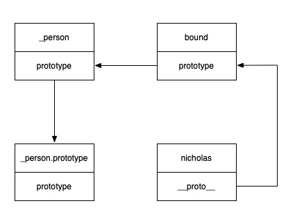
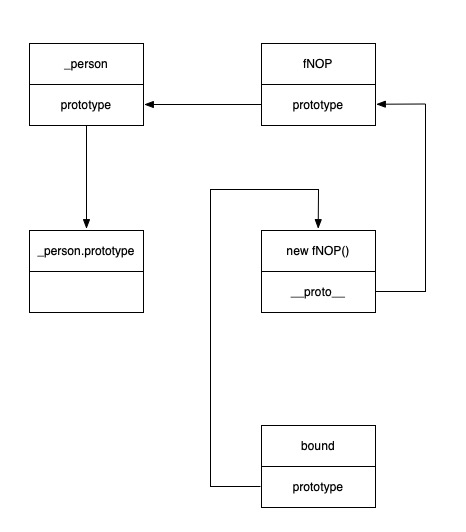

# 实现 bind 方法  
`bind` 方法会创建一个新的函数（ 称为绑定函数 ），而调用 `bind` 方法的函数称为原始函数，绑定函数的 `this` 会指向为 `bind` 方法的第一个参数，而其余的参数会依次传递给原始函数。

## 版本一  
```javascript
/**
 *  @param   { any } context 作用域对象
 *  @returns { Function }    绑定函数
 */
Function.prototype._bind = function ( context ) {
    // 获取原始函数以及除了作用域之外的参数
    const self = this;
    const args = Array.prototype.slice.call( arguments, 1 );

    // 返回一个绑定函数，以供后续调用
    return function bound () {
        // 在绑定函数内，获取调用绑定函数时的参数
        const innerArgs = Array.prototype.slice.call( arguments );
        // 通过 apply 调用原始函数，并指定原始函数的作用域为 context，并且合并参数
        self.apply( context, args.concat( innerArgs ) );
    }
}
```  

在下面的示例中，使用自定义的 `_bind` 方法是没有任何问题的，成功修改了 `test` 的作用域
```javascript
const testObj = { name: 'IconMan' };
function test ( a, b, c, d ) {
    console.log( this, a, b, c, d );
}
const testBind = test._bind( testObj, 1, 2, 3 );
testBind( 4 );  // 打印 { name: 'IconMan' } 1, 2, 3, 4
```  

再看下面这段代码，我们把绑定函数当作构造函数  
对于普通的构造函数来说，其中的 `this` 是会发生变化的，而对于绑定函数来说，`this` 是一直被我们绑定死的，所以下面生成的 `nicholas` 实例是错误的。
```javascript
const _personObject = { name: 'IconMan' };
function _person ( name ) {
    this.name = name;
}
const Person = _person._bind( _personObject );
const nicholas = new Person( 'Nicholas' );
console.log( nicholas );
```  
所以，我们需要根据外部的调用环境，来动态的修改原始函数的 `this` 指向。  

## 版本二  
```javascript
/**
 *  @param   { any } context 作用域对象
 *  @returns { Function }    绑定函数
 */
Function.prototype._bind = function ( context ) {
    const self = this;
    const args = Array.prototype.slice.call( arguments, 1 );

    function bound () {
        const innerArgs = Array.prototype.slice.call( arguments );
        // 调用原始函数，并判断调用方法来修改 this 的指向
        self.apply( this instanceof self ? this : context, args.concat( innerArgs ) );
    }

    // 修改绑定函数的原型
    bound.prototype = self.prototype;

    return bound;
}
```  
在这个版本里，关键的一句是   
```javascript
this instanceof self ? this : context
```   
这句代码可以判断当前是否通过 `new` 来调用绑定函数，而这句代码能有效的条件就是  
```javascript
bound.prototype = self.prototype
```

先通过下面的例子来理解这两句代码的意义  
```javascript
const _personObject = { name: 'IconMan' };
function _person ( name ) {
    this.name = name;
}
const Person = _person._bind( _personObject );
const nicholas = new Person( 'Nicholas' );
console.log( nicholas );    // { name: 'Nicholas' }
```  
   

通过上面的示例图，可以看出以下几点    
* 如果我们将绑定函数作为构造函数使用，那么 `bound` 中的 `this` 就指向 `nicholas`， 而 `nicholas`的原型 `__proto__` 也就指向了绑定函数的原型，即最终指向原始函数的原型。  
* 所以，`this instanceof self` 也就是 `true`，所以就是通过 `new` 来调用绑定函数的。   

这个版本的 `bind` 几乎完美，还差最后一点，此时绑定函数的原型和原始函数的原型指向了同一内存，所以如果我们向绑定函数的原型上增加属性，那么原始函数也会受到影响，所以我们需要一个“中间人”来处理。 

## 版本三
```javascript
/**
 *  @param   { any } context 作用域对象
 *  @returns { Function }    绑定函数
 */
Function.prototype._bind = function ( context ) {
    const self = this;
    const args = Array.prototype.slice.call( arguments, 1 );

    function bound () {
        const innerArgs = Array.prototype.slice.call( arguments );
        // 调用原始函数，并判断调用方法来修改 this 的指向
        self.apply( this instanceof fNOP ? this : context, args.concat( innerArgs ) );
    }

    // 中间函数
    function fNOP () {}

    // 修改中间函数的原型为原始函数的原型
    fNOP.prototype  = self.prototype;
    // 绑定函数继承中间函数，也就继承了原始函数
    bound.prototype = new fNOP();

    return bound;
}
```   
此时，内存图已经改为如下  
  

现在，修改原始函数的原型和绑定函数的原型不再会互相影响