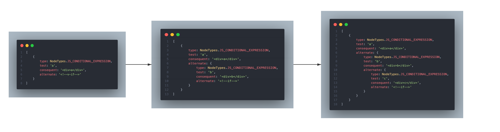

<!-- TOC -->

- [v-if 相关节点](#v-if-相关节点)
    - [v-if 节点](#v-if-节点)
    - [if 分支节点](#if-分支节点)
    - [if 条件表达式节点](#if-条件表达式节点)
- [v-if 转换函数 —— transformIf](#v-if-转换函数--transformif)
    - [处理 v-if —— processIf](#处理-v-if--processif)
    - [创建生成器回调 —— processCodegen](#创建生成器回调--processcodegen)
- [获取上一个分支的表达式节点 —— getParentCondition](#获取上一个分支的表达式节点--getparentcondition)
- [创建分支的生成器 —— createCodegenNodeForBranch](#创建分支的生成器--createcodegennodeforbranch)
- [创建子节点的生成器节点 —— createChildrenCodegenNode](#创建子节点的生成器节点--createchildrencodegennode)

<!-- /TOC -->

**这篇开始详细介绍 `v-for` 指令的相关内容，它属于结构指令，所以最终会被放进作用域中的 `nodeTransforms` 而不是 `directiveTransforms`**  

## v-if 相关节点  

### v-if 节点  
先来看 `if` 节点的结构  

```ts
export interface IfNode extends Node {
    // 节点类型
    type: NodeTypes.IF
    // 节点分支集合
    branches: IfBranchNode[]
    // if 生成器节点
    codegenNode?:
        IfConditionalExpression |   // if 表达式节点 <div v-if />
        CacheExpression             // 缓存表达式节点 <div v-if v-once>
}
```

这个 `IfNode` 类型，实际不是指具体的 `v-if` 指令，而是将 `v-if`、`v-else-if` 和 `v-else` 三种指令合成的一种节点  
这三种指令其实属于 `if` 分支节点，即 `IfBranchNode`，它们作为 `branches` 存储于 `IfNode` 中  
`IfNode.branches` 最少也会有一个元素，就是 `v-if` 分支  

### if 分支节点  
先来看分支节点的结构  

```ts
export interface IfBranchNode extends Node {
    type: NodeTypes.IF_BRANCH               // 节点类型为 if 分支
    condition: ExpressionNode | undefined   // 分支的条件，v-else 不存在条件
    children: TemplateChildNode[]           // 分支子节点
    userKey?: AttributeNode | DirectiveNode // 每个分支都具有 key 属性
}
```

其中 `children` 所指的就是分支所在的节点，而且一定是数组  

这里先了解下大致的转换过程，例如以下代码  

```html
<div v-if="a">a</div>
<div v-else-if="b">b</div>
<div v-else>c</div>
```

会被转换为下面的节点(伪代码)  

```ts
{
    type: NodeTypes.IF,
    branches: [
        {
            type: NodeTypes.IF_BRANCH,
            condition: 'a',
            children: ['<div>a</div>']
        },
        {
            type: NodeTypes.IF_BRANCH,
            condition: 'b',
            children: ['<div>b</div>']
        },
        {
            type: NodeTypes.IF_BRANCH,
            condition: undefined,
            children: ['<div>c</div>']
        },
    ]
}
```

接下来看创建分支节点的过程  

```ts
function createIfBranch(node: ElementNode, dir: DirectiveNode): IfBranchNode {
    return {
        // 节点类型为 if 分支
        type: NodeTypes.IF_BRANCH,
        // 定位为节点的定位
        loc: node.loc,
        // 条件，v-else 为 undefined，v-if、v-else-if 为指令的值
        condition: dir.name === 'else' ? undefined : dir.exp,
        // 子节点
        // 不带有 v-for 的 template，就是 template 的子元素
        // 剩余情况都是元素自身组成的数组
        children:
            node.tagType === ElementTypes.TEMPLATE && !findDir(node, 'for')
                ? node.children
                : [node],
        userKey: findProp(node, `key`)
    }
}
```

可以看到，针对于没有 `v-for` 的 `template` 元素，相当于跳过了 `template`，直接获取了子元素，例如  

```html
<template v-if="a">
    <div>a</div>
    <div>b</div>
</template>
```

会被转换为(伪代码)  

```ts
{
    type: NodeTypes.IF,
    branches: [
        {
            type: NodeTypes.IF_BRANCH,
            condition: 'a',
            children: [
                '<div>a</div>',
                '<div>b</div>',
            ]
        },
    ]
}
```  

而对于 `template` 上存在 `v-for` 的节点来说，会保留 `template`，例如  

```html
<template v-if="a" v-for="item in items">
    <div>name</div>
</template>
```  

```ts
{
    type: NodeTypes.IF,
    branches: [
        {
            type: NodeTypes.IF_BRANCH,
            condition: 'a',
            children: [
                '<template v-for="item in items"><div>name</div></template>',
            ]
        },
    ]
}
```   

### if 条件表达式节点  
可以看到，`if` 节点的生成器可能是 `if` 条件表达式 —— `IfConditionalExpression`，这个节点能描述 `if..else if..else` 这种形式，先来看它的结构  

```ts
export interface IfConditionalExpression extends ConditionalExpression {
    // 满足条件的节点
    consequent: BlockCodegenNode
    // 不满足条件的节点
    alternate: BlockCodegenNode | IfConditionalExpression
}
```

其中 `BlockCodegenNode` 是 `block` 生成器，说明它可能会开启新的 `block`，它的类型如下  

```ts
export type BlockCodegenNode = 
    VNodeCall |     // <div v-if />
    RenderSlotCall  // <slot v-if />
```

当在 `slot` 上使用 `v-if` 时，那么 `consequent` 就指向 `RenderSlotCall`  

再来看不满足条件的 `alternate` 可能还是一个 `IfConditionalExpression`，这里为什么会出现嵌套关系？
实际就是把 `else..if` 又当做一个 `if` 看待，这样就能描述多个 `else..if` 了  

例如有下面代码  

```html
<div v-if="a">a</div>
<div v-else-if="b">b</div>
<div v-else-if="c">c</div>
<div v-else>d</div>
```

用下面的结构就可以描述上面的 `if` 表达式
```ts
{
    type: NodeTypes.JS_CONDITIONAL_EXPRESSION,
    test: 'a',
    consequent: '<div>a</div>',
    alternate: {
        type: NodeTypes.JS_CONDITIONAL_EXPRESSION,
        test: 'b',
        consequent: '<div>b</div>',
        alternate: {
            type: NodeTypes.JS_CONDITIONAL_EXPRESSION,
            test: 'c',
            consequent: '<div>c</div>',
            alternate: '<div>d</div>'
        }
    }
}
```  

## v-if 转换函数 —— transformIf  
`transformIf` 的实现很简单，通过 [createStructuralDirectiveTransform]() 生成  

```ts
export const transformIf = createStructuralDirectiveTransform(
    /^(if|else|else-if)$/,
    (node, dir, context) => {
        return processIf(node, dir, context, (ifNode, branch, isRoot) => {
            /* ... */
        })
    }
)
```

### 处理 v-if —— processIf  
这个函数是转换 `v-if` 的真正函数，被 [transformIf](#v-if-转换函数--transformif) 调用

```ts
export function processIf(
    node: ElementNode,          // 带有 v-if 的元素节点
    dir: DirectiveNode,         // 指令节点
    context: TransformContext,  // 作用域
    processCodegen?: (          // 创建生成器的回调
        node: IfNode,           // if 节点
        branch: IfBranchNode,   // 分支节点
        isRoot: boolean         // 是否是 v-if 分支，false 代表是 v-else-if 或 v-else
    ) => (() => void) | undefined
) {
    // 1. 检测指令的合法性：v-if 或 v-else-if 必须存在有效的值，如果没有则抛错，并且使用 true 作为值
    if (
        dir.name !== 'else' &&
        (!dir.exp || !(dir.exp as SimpleExpressionNode).content.trim())
    ) {
        const loc = dir.exp ? dir.exp.loc : node.loc
        context.onError(
            createCompilerError(ErrorCodes.X_V_IF_NO_EXPRESSION, dir.loc)
        )
        // 和解析的指令值结果保持一致，均使用动态值
        dir.exp = createSimpleExpression(`true`, false, loc)
    }

    // 2. 对指令值增加数据来源前缀，这一步完成指令值可能是 SimpleExpressionNode 也可能是 CompoundExpressionNode
    //    例如 v-if="a + b"
    if (!__BROWSER__ && context.prefixIdentifiers && dir.exp) {
        dir.exp = processExpression(dir.exp as SimpleExpressionNode, context)
    }

    // 3. 处理 v-if
    if (dir.name === 'if') {
        // 3.1 创建 v-if 分支节点
        const branch = createIfBranch(node, dir)
        // 3.2 创建 if 节点，并将 v-if 分支存入 branches 中
        const ifNode: IfNode = {
            type: NodeTypes.IF,
            loc: node.loc,
            branches: [branch]
        }
        // 3.3 将当前节点替换为 if 节点，替换后成功后，在 traverseNode 中，会对每个分支节点进行遍历
        //     注意，替换后 parent 的 children 就是 ifNode, others...
        context.replaceNode(ifNode)
        // 3.4 创建生成器，并将 processCodegen 的返回值作为 v-if 钩子函数的 退出函数
        if (processCodegen) {
            return processCodegen(ifNode, branch, true)
        }
    }
    // 4. 处理 v-else-if、v-else
    else {
        // 4.1 获取所有子节点，siblings 中至少有一个 ifNode 节点
        const siblings = context.parent!.children
        // 4.2 存放注释的列表
        const comments = []
        // 4.3 获取当前节点的索引
        let i = siblings.indexOf(node)
        // 4.4 从当前节点向前遍历
        while (i-- >= -1) {
            // 4.4.1 获取前一个节点
            const sibling = siblings[i]
            // 4.4.2 如果前一个节点是注释，那么会把注释移除，并存入 comments 中
            if (__DEV__ && sibling && sibling.type === NodeTypes.COMMENT) {
                context.removeNode(sibling)
                comments.unshift(sibling)
                continue
            }

            // 4.4.3 如果前一个节点是空白的文本节点，直接将文本移除
            if (
                sibling &&
                sibling.type === NodeTypes.TEXT &&
                !sibling.content.trim().length
            ) {
                context.removeNode(sibling)
                continue
            }

            // 4.4.4 如果前一个节点是 if 节点
            if (sibling && sibling.type === NodeTypes.IF) {
                // 4.4.5 将当前节点移除
                context.removeNode()
                // 4.4.6 为当前节点创建分支节点
                const branch = createIfBranch(node, dir)
                // 4.4.7 如果当前节点前存在注释，那么会将注释放在当前节点前
                if (__DEV__ && comments.length) {
                    branch.children = [...comments, ...branch.children]
                }

                // 4.4.8 将当前分支存入 if 节点中
                sibling.branches.push(branch)
                // 4.4.9 为当前分支创建生成器
                const onExit = processCodegen && processCodegen(sibling, branch, false)
                // 4.4.10 新创建的分支节点还没有遍历，所以需要重新遍历
                traverseNode(branch, context)
                // 4.4.11 在所有的子节点遍历完成后，调用退出函数
                if (onExit) onExit()
                // TODO:
                context.currentNode = null
            }
            // 4.4.5 v-else-if、v-else 前面没有 v-if，抛错
            else {
                context.onError(
                    createCompilerError(ErrorCodes.X_V_ELSE_NO_ADJACENT_IF, node.loc)
                )
            }
            break
        }
    }
}
```

在 4.4 中，可以看到，创建分支节点后，会手动调用一次 `traverseNode` 对分支节点进行转换，为什么这里需要手动调用？为什么在步骤 3 中不需要？  

1. 首先在步骤 3 中，将当前节点替换成了分支节点，那么分支节点会在 [traversenode]() 中进行转换  

2. 但在步骤 4 中，首先会将当前节点移除，还记得在 [traversenode]() 对删除节点会如何处理吗？会立即停止遍历钩子函数  
    也就是说，当前节点不会继续向下进行转换了，所以这里要手动对分支节点调用一次 `traverseNode`，从而对分支下的所有子节点进行转换  

接下来看生成器节点的创建  

### 创建生成器回调 —— processCodegen  
```ts
return processIf(node, dir, context, (ifNode, branch, isRoot) => {
    // 1. 获取子节点集合
    const siblings = context.parent!.children
    // 2. 获取当前 if 节点在父节点中的索引
    let i = siblings.indexOf(ifNode)
    // 3. 创建分支的 key，初始为前面所有的 v-if、v-else-if、v-else 分支数之和
    let key = 0
    while (i-- >= 0) {
        const sibling = siblings[i]
        if (sibling && sibling.type === NodeTypes.IF) {
            key += sibling.branches.length
        }
    }

    // 4. 退出函数，当所有子节点都完成转换时再调用
    return () => {
        // 4.1 创建 v-if 分支的生成器，挂载在 if 节点上
        if (isRoot) {
            ifNode.codegenNode = createCodegenNodeForBranch(
                branch,
                key,
                context
            ) as IfConditionalExpression
        }
        // 4.2 创建 v-else-if、v-else 的生成器
        else {
            // 4.2.1 首先获取上一个条件表达式
            const parentCondition = getParentCondition(ifNode.codegenNode!)
            // 4.2.2 修改上一个分支的 alternate，指向当前分支的生成器
            parentCondition.alternate = createCodegenNodeForBranch(
                branch,
                // 前面所有 if 分支的总和 + 当前 if 分支的长度-1
                // 此时，当前 if 分支已经是包含最新的分支了
                key + ifNode.branches.length - 1,
                context
            )
        }
    }
})
```

1. 可以看到，源码中对每一个分支都创建了 `key`，并且在同一层子节点中，`key` 是依次递增的，无论有多少个 `v-if`，例如  

    ```html
    <div>
        <div v-if="a">a</div>
        <div v-else-if="b">b</div>
        <div v-else="b">c</div>
        <div v-if="d">d</div>
        <div v-else-if="e">e</div>
    </div>
    ```

    上面 4 个分支的 `key` 依次为 0，1，2，3，4  

2. 接下来看看 4.2 中是如何生成 `v-else-if` 和 `v-else` 的生成器的  
    之前说过，存在多个 `v-else-if` 的话，会形成嵌套的结构，对于每个 `v-else-if`，实际是按照 `v-if` 去处理的  
    也就是说，`v-else-if` 分支的生成器也是 条件表达式(和 `v-if` 一样)，但不同的是，`v-else-if` 的生成器会作为上一个分支的 `alternate`  
    上一个分支可能是 `v-if`，也有可能是 `v-else-if`  
    
    这样，开始的 `v-if` 生成器是一个 条件表达式，满足条件是具体节点的生成器，不满足条件是下一个 `v-else-if` 的生成器，也是 条件表达式，满足条件是具体节点的生成器，不满足条件是下一个 `v-else-if` 的生成器，一直重复下去  

    所以在 4.2 中首先要获取上一个分支的 条件表达式，然后再为当前分支创建生成器，并作为上一个分支的 `alternate`  

    下面这个示例形成的过程如下图  
    
    ```html
    <div v-if="a">a</div>
    <div v-else-if="b">b</div>
    <div v-else-if="c">c</div>
    ```

      

## 获取上一个分支的表达式节点 —— getParentCondition  
经过上面的内容，已经了解了什么是上一个分支的表达式节点以及为什么需要它，接下来具体实现  

```ts
function getParentCondition(
    node: IfConditionalExpression | CacheExpression // if 生成器
): IfConditionalExpression {
    // 每次都会从 if 的生成器开始查找
    
    while (true) {
        // 1. 处理 if 生成器是条件表达式
        //    检测不满足条件的 alternate 是否也是条件表达式
        //      如果是，则说明已经存在 v-else-if 了，则继续检测 v-else-if 的生成器
        //      如果不是，则说明 node 就是最新分支的表达式
        if (node.type === NodeTypes.JS_CONDITIONAL_EXPRESSION) {
            if (node.alternate.type === NodeTypes.JS_CONDITIONAL_EXPRESSION) {
                // 存在嵌套，修改 node 为嵌套的 条件表达式，继续查找，直到没有嵌套为止
                node = node.alternate
            } else {
                // 没有嵌套，直接返回 v-if 产生的 条件表达式
                return node
            }
        }
        // 2. 处理 if 生成器是缓存表达式
        else if (node.type === NodeTypes.JS_CACHE_EXPRESSION) {
            node = node.value as IfConditionalExpression
        }
    }
}
```  

注意：  
第 2 步中处理了 `if` 的生成器是缓存的情况，什么时候会发生这种情况呢？  

```html
<div v-if="a" v-once></div>
```  

当同时带有 `v-if` 以及 `v-once` 时，`if` 的生成器就不再是原本的 条件表达式 了，而是缓存节点  
缓存节点其中的 `value` 指向原本的 条件表达式(具体内容可以参考 [v-once]())  

此时会获取到缓存中的 条件表达式，再次对其进行第 1 步的操作，从而获取上一个分支的条件表达式  

## 创建分支的生成器 —— createCodegenNodeForBranch  
每个分支都会对应一个生成器    
* 对于有条件的分支，它的生成器是 ”条件表达式“  
  其中满足条件指向的是子节点的生成器  
  不满足条件指向的是注释节点生成器  
* 对于没有条件的分支来说，它的生成器就是创建具体节点的生成器  

接下来看创建分支生成器节点的具体实现  

```ts
function createCodegenNodeForBranch(
    branch: IfBranchNode,     // 分支节点
    keyIndex: number,         // 分支 key
    context: TransformContext // 作用域
): IfConditionalExpression | BlockCodegenNode {
    // 1. 处理 v-if、v-else-if
    if (branch.condition) {
        // 1.1 创建条件表达式节点
        return createConditionalExpression(
            branch.condition,
            // 创建满足条件的节点生成器
            createChildrenCodegenNode(branch, keyIndex, context),
            // 创建不满足条件的节点生成器，v-if 和 v-else-if 不满足条件的节点都是注释
            createCallExpression(context.helper(CREATE_COMMENT), [
                __DEV__ ? '"v-if"' : '""',
                'true'
            ])
        ) as IfConditionalExpression
    }
    // 2. 处理 v-else
    else {
        return createChildrenCodegenNode(branch, keyIndex, context)
    }
}
```

## 创建子节点的生成器节点 —— createChildrenCodegenNode  
每个分支下存在具体渲染的子节点 `children`，这个函数就是创建 `children` 的生成器  

```ts
function createChildrenCodegenNode(
    branch: IfBranchNode,     // 分支节点
    keyIndex: number,         // 分支 key
    context: TransformContext // 作用域对象
): BlockCodegenNode {
    const { helper } = context
    // 1. 创建分支 key 的属性节点
    const keyProperty = createObjectProperty(
        `key`,
        // 创建 key 的表达式，非静态
        createSimpleExpression(
            `${keyIndex}`,
            false,
            locStub,
            ConstantTypes.CAN_HOIST
        )
    )

    // 2. 获取子节点集合，以及第一个子节点
    const { children } = branch
    const firstChild = children[0]

    // 3. 检测是否需要包裹 Fragment 节点，满足以下任意条件就需要包裹
    //    a. 有多个子节点，<template v-if />
    //    b. 第一个节点不是元素，<template v-if>text</template>
    const needFragmentWrapper =
        children.length !== 1 ||
        firstChild.type !== NodeTypes.ELEMENT

    // 4. 需要 Fragment
    if (needFragmentWrapper) {
        // 4.1 处理 <template v-if><div v-for /></template> 的情况
        if (children.length === 1 && firstChild.type === NodeTypes.FOR) {
            // 直接将 v-for 的生成器作为分支的生成器，并注入 key 属性
            const vnodeCall = firstChild.codegenNode!
            injectProp(vnodeCall, keyProperty, context)
            return vnodeCall
        }
        // 4.2 处理多个子节点，或者第一个子节点不是 v-for 的情况
        //     创建 Fragment 的生成器作为分支的生成器
        else {
            return createVNodeCall(
                context,
                helper(FRAGMENT),
                // if 所产生的 key 作用在了 Fragment 上
                createObjectExpression([keyProperty]),
                children,
                // Fragment 的 PatchFlag 为 STABLE_FRAGMENT
                PatchFlags.STABLE_FRAGMENT +
                (__DEV__
                    ? ` /* ${PatchFlagNames[PatchFlags.STABLE_FRAGMENT]} */`
                    : ``),
                undefined,
                undefined,
                // 强制开启 block
                true,
                false,
                branch.loc
            )
        }
    }
    // 5. 不需要 Fragment，说明也只有一个子节点，且不是文本
    else {
        // 5.1 直接获取子节点的生成器，作为当前分支的生成器
        const vnodeCall = (firstChild as ElementNode).codegenNode as BlockCodegenNode
        // 5.2 如果是节点的生成器，则强制开始 block
        if (vnodeCall.type === NodeTypes.VNODE_CALL) {
            vnodeCall.isBlock = true
            helper(OPEN_BLOCK)
            helper(CREATE_BLOCK)
        }
        // 5.3 注入 if 分支产生的 key 到生成器中
        injectProp(vnodeCall, keyProperty, context)
        // 5.4 返回生成器
        return vnodeCall
    }
}
```

注意：  

1. 在创建 `key` 的属性节点是，标明常量类型属于 `ConstantTypes.CAN_HOIST`，也就是说这个 `key` 是可能被静态提升的  