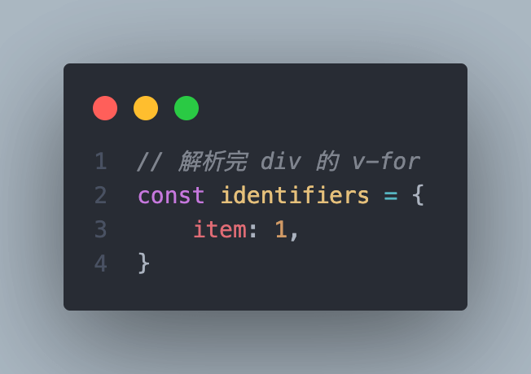
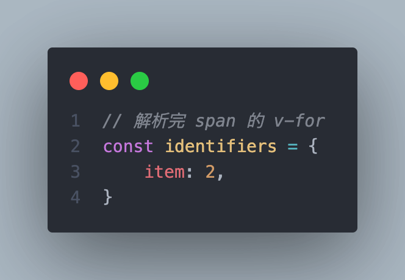
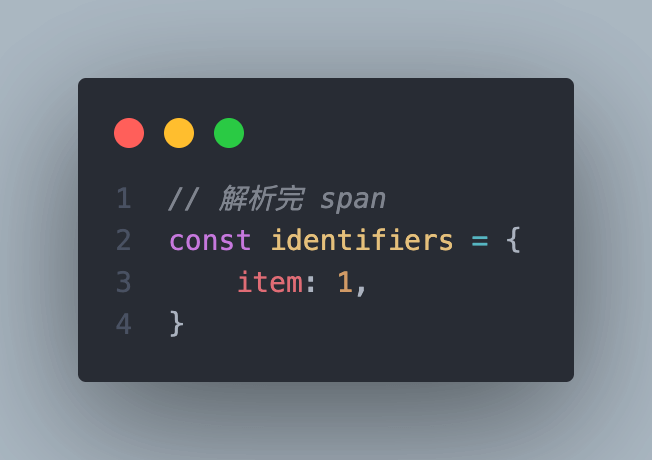
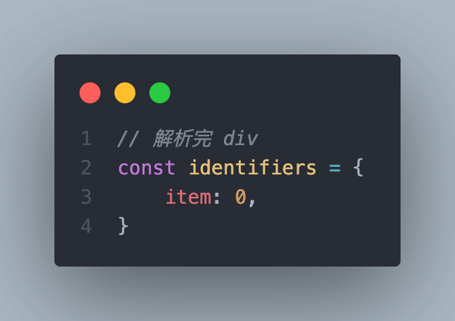

<!-- TOC -->

- [什么是转换表达式](#什么是转换表达式)
- [存储数据标识](#存储数据标识)
    - [增加标识符 —— addIdentifiers](#增加标识符--addidentifiers)
    - [增加标识符个数 —— addId](#增加标识符个数--addid)
    - [移除标识符 —— removeIdentifiers](#移除标识符--removeidentifiers)
    - [移除标识符个数 —— removeId](#移除标识符个数--removeid)
- [转换表达式 —— transformExpression](#转换表达式--transformexpression)
- [转换过程 —— processExpression](#转换过程--processexpression)
    - [简单型数据](#简单型数据)
    - [复杂型数据](#复杂型数据)
        - [检测是否是函数节点 —— isFunction](#检测是否是函数节点--isfunction)
        - [检测是否是静态属性节点 —— isStaticProperty](#检测是否是静态属性节点--isstaticproperty)
        - [检测静态属性的名称是否和指定节点一致 —— isStaticPropertyKey](#检测静态属性的名称是否和指定节点一致--isstaticpropertykey)
        - [转换过程](#转换过程)
            - [babel 解析](#babel-解析)
            - [babel AST 转换](#babel-ast-转换)
            - [创建复合表达式](#创建复合表达式)

<!-- /TOC -->

## 什么是转换表达式  
例如在模板中有以下内容  

```html
<div>{{ name }}</div>
```  

这段模板最终会被编译成  

```ts
_createVNode("div", null, _toDisplayString(_ctx.name), 1 /* TEXT */)
```  

可以看到，`name` 前面增加了数据来源前缀 `_ctx`，标明了数据来源，这个过程就是 “转换表达式”  
也就是增加数据的来源前缀  

## 存储数据标识  
接下来补充作用域中与 “标识符” 有关的内容  

首先来看存储 “标识符” 的字段 `identifiers`，它在创建作用域的时候被初始化为一个空对象  

```ts
// 声明
identifiers: { [name: string]: number | undefined }
// 定义
identifiers: Object.create(null)
```  

其中 `key` 是变量名，而 `value` 是变量名引用的个数  

那什么时候会需要这个值呢？  
先看下面的示例  

```html
<div @click="$event => $event"></div>
```  
在事件处理函数中，`$event` 属于参数，所以是不需要增加前缀的，此时 `identifiers` 就是  

```ts
identifiers: {
    '$event': 1
}
```    

再看另一个示例  

```html
<div v-for="(item, key, index) in items" :key="key">
    <span>{{ index }}-{{ item.name }}</span>
</div>
```  
在 `v-for` 中的 `item`、`key` 以及 `index` 这三个也都不会增加前缀，此时 `identifiers` 就是  

```ts
identifiers: {
    'item': 1,
    'key': 1,
    'index': 1,
}
```  

至于 `value` 为什么是数字，是因为可能存在同一个变量名，进行了多次引用，例如在嵌套 `v-for` 时  

```html
<div v-for="item in list1">
    <span v-for="item in list2"></span>
    <i>{{ item.name }}</i>
</div>
```  

`identifiers` 的过程如下  

<div style="display: flex;">
    
    
    
    
</div>

所以在 `i` 标签中的 `item` 实际指向的是 `div.v-for` 中的 `item`  

**总结：如果变量的引用个数不为 0，说明这个变量在某个作用域内是存在引用的，不会增加前缀，原样输出**  

### 增加标识符 —— addIdentifiers  
对指定变量增增加引用个数  

```ts
// 声明
addIdentifiers(exp: ExpressionNode | string): void
// 实现
addIdentifiers(exp) {
    // 具体过程使用 addId 函数实现
    // 如果变量是 string，直接添加
    // 如果变量是表达式节点
    //   存在 identifiers，将其中每个变量都添加
    //   对于简单表达式，添加其值
    if (!__BROWSER__) {
        if (isString(exp)) {
            addId(exp)
        } else if (exp.identifiers) {
            exp.identifiers.forEach(addId)
        } else if (exp.type === NodeTypes.SIMPLE_EXPRESSION) {
            addId(exp.content)
        }
    }
}
```  

### 增加标识符个数 —— addId  
```ts
function addId(id: string) {
    const { identifiers } = context
    if (identifiers[id] === undefined) {
        identifiers[id] = 0
    }
    identifiers[id]!++
}
```  

### 移除标识符 —— removeIdentifiers  
移除代表将

```ts
// 删除和添加的过程一致，这里不再重复说明
removeIdentifiers(exp) {
    if (!__BROWSER__) {
        if (isString(exp)) {
            removeId(exp)
        } else if (exp.identifiers) {
            exp.identifiers.forEach(removeId)
        } else if (exp.type === NodeTypes.SIMPLE_EXPRESSION) {
            removeId(exp.content)
        }
    }
},
```  

### 移除标识符个数 —— removeId  
```ts
function removeId(id: string) {
    context.identifiers[id]!--
}
```   

## 转换表达式 —— transformExpression  
转换表达式 的钩子很简单，

```ts
export const transformExpression: NodeTransform = (node, context) => {
    // 1. 对插值表达式的值进行转换
    if (node.type === NodeTypes.INTERPOLATION) {
        node.content = processExpression(
            node.content as SimpleExpressionNode,
            context
        )
    }
    // 2. 对元素的指令进行转换
    else if (node.type === NodeTypes.ELEMENT) {
        for (let i = 0; i < node.props.length; i++) {
            const dir = node.props[i]
            // 2.1 只会处理除 v-for 之外指令，v-for 会在单独的钩子中处理
            if (dir.type === NodeTypes.DIRECTIVE && dir.name !== 'for') {
                // 2.2 获取指令参数和值的节点
                const exp = dir.exp
                const arg = dir.arg
                // 2.3 解析指令的值
                //     除了 v-on 之外，剩下的指令值都会转换
                //     当 v-on 指令不带参数也会解析，也就是 v-on="handlers"，带参数会在 v-on 的指令钩子中处理
                if (
                    exp &&
                    exp.type === NodeTypes.SIMPLE_EXPRESSION &&
                    !(dir.name === 'on' && arg)
                ) {
                    dir.exp = processExpression(
                        exp,
                        context,
                        // slot args must be processed as function params
                        dir.name === 'slot'
                    )
                }
                // 2.4 解析指令动态参数
                if (arg && arg.type === NodeTypes.SIMPLE_EXPRESSION && !arg.isStatic) {
                    dir.arg = processExpression(arg, context)
                }
            }
        }
    }
}
```  

具体的转换过程由 [processExpression](#转换过程--processexpression) 完成，接下来就看这个函数做了什么  

## 转换过程 —— processExpression  
先来看各个参数的意义  
```ts
export function processExpression(
    // 需要转换的表达式节点，还没有经过任何钩子处理，所以是 解析 过程中生成的简单表达式节点
    node: SimpleExpressionNode,
    // 作用域
    context: TransformContext,
    // 是否作为参数
    asParams = false,
    // 是否作为语句
    asRawStatements = false
): ExpressionNode {
    /* ... */
}
```  

1. 什么是作为参数？  
    指节点的内容是函数的参数，参数名是自定义的，所以函数的参数是不需要 增加前缀 的  

    ```html
    <div v-for="(item, key, index) in items"></div>
    ```  
    `v-for` 中的 `item`、`key` 以及 `index` 都属于参数，所以在解析这三个值时，`asParams` 就是 `true`  

2. 什么是作为语句？
    指节点的内容是 `JS` 的语句，只有在 `v-on` 中存在多个语句时，这个值才会为 `true`  

    ```html
    <div @click="foo(); bar();"></div>
    ```  

3. 返回值为 `ExpressionNode`  
    转过过程根据节点内容分为 “简单型” 和 “复杂型” 两种  
    * 简单型，可以理解为单个变量，例如 `{{ name }}`，最后的结果依然是 简单表达式  
    * 复杂型，可以理解为存在其他操作的变量，例如 `{{ info.name }}`、`{{ ++info }}`，最后生成会是 复合表达式  

接下来先介绍 简单型 的处理   

### 简单型数据  
```ts
export function processExpression(
    node: SimpleExpressionNode,
    context: TransformContext,
    asParams = false,
    asRawStatements = false
): ExpressionNode {
    if (__BROWSER__) {
        return node
    }
    
    // 1. 检测是否满足转换的条件，不满足直接退出
    //    1). 必须开启 prefixIdentifiers 选项
    //    2). 节点中的值是有效值
    if (!context.prefixIdentifiers || !node.content.trim()) {
        return node
    }

    // 2. 获取原始值的变量名
    const rawExp = node.content

    // 3. 检测变量名是否是简单型
    if (isSimpleIdentifier(rawExp)) {
        // 3.1 检测变量名是否是否存在于作用域中
        const isScopeVarReference = context.identifiers[rawExp]
        // 3.2 检测变量名是否是全局变量
        const isAllowedGlobal = isGloballyWhitelisted(rawExp)
        // 3.3 检测变量名是否是字面量常量
        const isLiteral = isLiteralWhitelisted(rawExp)
        // 3.4 只有满足以下 4 个条件，才会真正进行处理
        //     1). 变量名不是函数参数
        //     2). 变量名不是作用域中的参数
        //     3). 变量名不是全局变量
        //     4). 变量名不是字面量常量
        if (!asParams && !isScopeVarReference && !isAllowedGlobal && !isLiteral) {
            // const bindings exposed from setup can be skipped for patching but
            // cannot be hoisted to module scope
            if (bindingMetadata[node.content] === BindingTypes.SETUP_CONST) {
                node.constType = ConstantTypes.CAN_SKIP_PATCH
            }
            // 3.4.2 重写变量名，增加数据来源前缀
            node.content = rewriteIdentifier(rawExp)
        }
        // 3.5 如果有一种情况不满足，则说明变量名是不需要增加前缀的
        //     接下里会处理不存在于作用域中的变量
        else if (!isScopeVarReference) {
            // 3.5.1 如果是字面量，则更新常量类型是 CAN_STRINGIFY，可以 string 化
            if (isLiteral) {
                node.constType = ConstantTypes.CAN_STRINGIFY
            }
            // 3.5.2 如果
            else {
                node.constType = ConstantTypes.CAN_HOIST
            }
        }
        // 3.6 返回原始的简单表达式简单
        return node
    }

    /* 接来下的步骤都是处理复杂型数据 */
}
```  

1. 接下来举例说明满足 3.4 的情况  
    ```html
    <div v-for="(item, key, index) in items">
        <span>{{ item }}</span>
        <span>{{ NaN }}</span>
        <span>{{ true }}</span>
    </div>
    ```  
    
    在解析 `v-for` 指令时，会将 `item`、`key` 以及 `index` 作为参数解析，并通过 [addIdentifiers](#增加标识符--addidentifiers) 添加到 `identifiers` 中  
    在解析 `{{ item }}` 时，发现 `isScopeVarReference` 的值为 `1`，所以不会进行重写变量名，并且也不会修改常量类型，因为 `item` 就是参数，所以无法静态提升    
    在解析 `{{ NaN }}` 时，发现 `isAllowedGlobal` 的值为 `true`，所以不会进行重写变量名，并且会将常量类型修改为 `ConstantTypes.CAN_HOIST`，从而使得这个节点可以静态提升    
    在解析 `{{ true }}` 时，发现 `isLiteral` 的值为 `true`，所以不会进行重写变量名，并且会将常量类型修改为 `ConstantTypes.CAN_STRINGIFY`，从而使得这个节点可以静态提升    


### 复杂型数据  
复杂型数据会通过 `babel` 来解析，首先来看几个检测节点类型的工具方法  

**注意，以下的 `Node` 和 `Identifier` 都属于 `babel` 生成的 `AST` 节点类型**  
`Node`: 所有节点的集合  
`Identifier`: 标识节点，例如 `foo++`、`foo(bar)`、`foo.bar` 中，`foo` 和 `bar` 都属于标识节点  

#### 检测是否是函数节点 —— isFunction  
这个函数用来检测函数节点，总共会有 4 种类型的函数，节点类型依次如下  

```ts
// 函数定义 —— FunctionDeclaration
function func1 () {}

// 函数表达式 —— FunctionExpression
const func2 = function () {}

// 箭头函数 —— ArrowFunctionExpression
const func3 = () => {}

// 对象属性函数 —— ObjectMethod
const obj = {
    func4 () {}
}
```  

所以只需要检测节点类型属于以上任意一种就说明是函数  

```ts
const isFunction = (node: Node): node is Function => {
    return /Function(?:Expression|Declaration)$|Method$/.test(node.type)
}
```  

#### 检测是否是静态属性节点 —— isStaticProperty  
这个函数用来检测对象的属性名是否是静态的，只有用 `[]` 包裹的属性名属于动态的(即计算属性)，在节点中用 `computed` 来表明是否是计算属性  
对象的属性只能有两种  
1. 普通属性 —— `ObjectProperty`  
2. 属性方法 —— `ObjectMethod`  

```ts
const obj = {
    // ObjectProperty
    name: 'IconMan',
    // ObjectMethod
    print () {}
}
```  

所以需要同时满足属于对象属性且不是计算属性即可  

```ts
const isStaticProperty = (node: Node): node is ObjectProperty =>
    node &&
    (node.type === 'ObjectProperty' || node.type === 'ObjectMethod') &&
    !node.computed
```  

#### 检测静态属性的名称是否和指定节点一致 —— isStaticPropertyKey  

```ts
const isStaticPropertyKey = (node: Node, parent: Node) =>
    // parent 必须是静态属性节点，并且属性名 key 要和指定 node 一致
    isStaticProperty(parent) && parent.key === node
```  

#### 转换过程  
接下来一步一步解释具体的过程  

##### babel 解析  
首先会通过 `babel/parse` 模块来解析复杂型变量  
这里会对原始的变量进行一层包装（第 2 步）  
1. 如果作为函数参数，则会创建空函数，并将变量放在参数里（具体原因可以参考 [babel ast 转换](#babel-ast-转换)）  


```ts
// 1. 解析后的 AST 节点
let ast: any
// 2. 对原始变量进行包装
const source = asRawStatements
    ? ` ${rawExp} `
    : `(${rawExp})${asParams ? `=>{}` : ``}`

// 3. 开始解析，使用 babel 的默认插件以及扩展插件
//    若解析错误，则抛出错误，解析结束
try {
    ast = parse(source, {
        plugins: [...context.expressionPlugins, ...babelParserDefaultPlugins]
    }).program
} catch (e) {
    context.onError(
        createCompilerError(
            ErrorCodes.X_INVALID_EXPRESSION,
            node.loc,
            undefined,
            e.message
        )
    )
    return node
}
```  

默认的 `babel` 插件如下  

```ts
export const babelParserDefaultPlugins = [
    'bigInt',                       // bigInt
    'optionalChaining',             // 可选链，a?.b
    'nullishCoalescingOperator'     // 空值合并操作，a?.b ?? 'aaa'
] as const
```  

也就是说，在模板中是可以使用 “可选连” 等比较新的语法，但是必须提供对应的插件去处理  

##### babel AST 转换  
解析后生成 `AST` 节点，接下里就到了第二步 —— 转换  
这个过程主要是操作每个 `Identifier` 节点，分析语法与上下文，来决定是否需要增加前缀  
最后将生成的好的节点与原始代码拼接，最终形成 “复合表达式”，例如存在以下数据  

```html
<div>{{ foo.bar(baz) }}</div>
```  

`div` 的子节点最终形成的 “复合表达式” 如下  

```ts
{
    type: NodeTypes.COMPOUND_EXPRESSION,
    children: [
        {
            type: NodeTypes.SIMPLE_EXPRESSION,
            content: '_ctx.foo',
        },
        '.',
        {
            type: NodeTypes.SIMPLE_EXPRESSION,
            content: 'bar',
        },
        '(',
        {
            type: NodeTypes.SIMPLE_EXPRESSION,
            content: '_ctx.baz',
        },
        ')'
    ]
}
```  

源码中使用 `estree-wolker` 模块来遍历 `AST` 节点

```ts
// 1. 所有标识节点的集合
const ids: (Identifier & PrefixMeta)[] = []
// 2. 当前作用域中已知变量引用集合
const knownIds = Object.create(context.identifiers)
// 3. 检测 ids 中的 node 是否重复
const isDuplicate = (node: Node & PrefixMeta): boolean => ids.some(id => id.start === node.start)
// 4. 父节点列表
const parentStack: Node[] = []

// 5. 遍历 AST 节点
;(walk as any)(ast, {
    // 5.1 入场钩子，每个节点都会调用
    enter(node: Node & PrefixMeta, parent: Node | undefined) {
        // 5.1.1 每遇到一个节点都会将其作为父节点，以供子节点中使用
        parent && parentStack.push(parent)
        // 5.1.2 TODO: 处理标识节点，并且果过滤重复的
        if (node.type === 'Identifier') {
            if (!isDuplicate(node)) {
                // 5.1.2.1 从语法层面分析是否应该对变量增加前缀
                const needPrefix = shouldPrefix(node, parent!, parentStack)
                // 5.1.2.2 如果变量在作用域中没有引用，并且语法上也需要增加前缀
                if (!knownIds[node.name] && needPrefix) {
                    // 5.1.2.2.1 如果父节点是对象属性，并且 key 是静态的，并且属性名和值是简写，例如 const obj = { foo }
                    //           那么此时的 node 无非是属性名或属性值中的 Identifier
                    if (isStaticProperty(parent!) && parent.shorthand) {
                        // 如果是这种情况，则会将属性名挂载在节点的 prefix 上，后面会用到
                        node.prefix = `${node.name}: `
                    }
                    // 5.1.2.2.2 重写变量名
                    node.name = rewriteIdentifier(node.name, parent, node)
                    // 5.1.2.2.3 存储 Identifier 节点
                    ids.push(node)
                }
                // 5.1.2.3 如果变量不需要增加前缀，再检测其是否属于静态属性的 key
                //         静态属性的 key 会被当做 string 拼接，所以要过滤
                else if (!isStaticPropertyKey(node, parent!)) {
                    // TODO: The identifier is considered constant unless it's pointing to a
                    // scope variable (a v-for alias, or a v-slot prop)
                    if (!(needPrefix && knownIds[node.name]) && !bailConstant) {
                        node.isConstant = true
                    }
                    ids.push(node)
                }
            }
        }
        // 5.1.3 处理函数节点
        //       主要目的就是将所有的有效参数存入 knownIds，使得参数变量引用 +1
        //       这样在接下来解析函数内部时，碰到参数变量时，由于已经存在引用，所以就不会再增加前缀了
        else if (isFunction(node)) {
            node.params.forEach(p => (walk as any)(p, {
                enter(child: Node, parent: Node) {
                    // 有效参数必须满足以下条件
                    // 1. 必须是标识节点
                    // 2. 不是静态属性的 key，静态属性的 key 会被当做 string 拼接
                    // 3. 不是赋值的右侧节点(包括参数默认值，解构默认值)，由于默认值变量是动态的，所以需要增加前缀
                    if (
                        child.type === 'Identifier' &&
                        !isStaticPropertyKey(child, parent) &&
                        !(
                            parent &&
                            parent.type === 'AssignmentPattern' &&
                            parent.right === child
                        )
                    ) {
                        // 获取参数变量名
                        const { name } = child
                        // TODO: 如果函数节点已经存在该变量，则不再继续任何操作
                        if (node.scopeIds && node.scopeIds.has(name)) {
                            return
                        }
                        // 修改变量名的引用
                        if (name in knownIds) {
                            knownIds[name]++
                        } else {
                            knownIds[name] = 1
                        }
                        // 将参数存储在函数节点中的 scopeIds 中
                        ;(node.scopeIds || (node.scopeIds = new Set())).add(name)
                    }
                }
            }))
        }
    },
    // 5.2 离开钩子，每个节点都会调用
    leave(node: Node & PrefixMeta, parent: Node | undefined) {
        // 5.2.1 移除当前节点
        parent && parentStack.pop()
        // 5.2.2 移除函数参数产生的引用
        if (node !== ast.body[0].expression && node.scopeIds) {
            node.scopeIds.forEach((id: string) => {
                knownIds[id]--
                if (knownIds[id] === 0) {
                    delete knownIds[id]
                }
            })
        }
    }
})
```  

##### 创建复合表达式  
经过上一步得到的 `ids` 节点列表以及原始变量内容，就可以组合出 “复合表达式” 了，接下来看具体过程  

```ts
// 1. 定义复合表达式节点的列表
const children: CompoundExpressionNode['children'] = []
// 2. 对 ids 中的每个节点，根据出现的位置进行排序
ids.sort((a, b) => a.start - b.start)
// 3. 遍历每个节点
ids.forEach((id, i) => {
    // 3.1 获取 id 开始的前一个位置
    const start = id.start - 1
    // 3.2 获取 id 结束的前一个位置
    const end = id.end - 1
    // 3.3 获取 id 的上一个节点 last
    const last = ids[i - 1]
    // 3.4 获取 id 距离 last 间的文本(以下称间距文本)
    //     如果没有 last(说明 id 是第一个)，则从头开始获取，一直到 id 的前一个位置为止
    //     如果存在 last，则从 last 结束位置的前一个字符开始，一直到 id 的前一个位置为止
    const leadingText = rawExp.slice(last ? last.end - 1 : 0, start)
    // 3.5 如果存在 间距文本 或者 id 存在前缀，则会将它们存入 复合表达式 中
    if (leadingText.length || id.prefix) {
        children.push(leadingText + (id.prefix || ``))
    }
    // 3.6 从 rawExp 中获取 id 的原始内容
    const source = rawExp.slice(start, end)
    // 3.7 创建 id.name 的简单表达式
    children.push(
        createSimpleExpression(
            id.name,
            // 动态
            false,
            {
                source,
                start: advancePositionWithClone(node.loc.start, source, start),
                end: advancePositionWithClone(node.loc.start, source, end)
            },
            // TODO: 
            id.isConstant ? ConstantTypes.CAN_STRINGIFY : ConstantTypes.NOT_CONSTANT
        )
    )
    // 3.8 插入最后一个节点之后的剩余文本内容
    if (i === ids.length - 1 && end < rawExp.length) {
        children.push(rawExp.slice(end))
    }
})

// 3.9 定义最终返回的节点
let ret
// 3.10 如果复合表达式存在列表，则创建对应的复合表达式
if (children.length) {
    ret = createCompoundExpression(children, node.loc)
}
// 3.11 如果不存在，则说明 node 还无法形成复合表达式，还是会使用原有的简单表达式
else {
    ret = node
    // TODO:
    ret.constType = bailConstant
        ? ConstantTypes.NOT_CONSTANT
        : ConstantTypes.CAN_STRINGIFY
}
// 3.12 TODO:
ret.identifiers = Object.keys(knownIds)

// 3.13 返回最后的节点 ret
return ret
```  

1. 为什么 `start` 和 `end` 要 - 1？  
    注意，在使用 `start` 和 `end` 截取时，都是在原始内容 `rawExp` 上操作的，而不是 `source`  
    再来看它们之间的区别，`source` 会在 `rawExp` 前后增加 空格 或者 `()`，这就导致用 `source` 解析出来的节点中，`start` 和 `end` 相对于 `rawExp` 是存在 1 的偏移  
    
    所以才会对它们 - 1，再通过 `rawExp` 来获取  
    也就能说明 `asRawStatements` 为 `true` 的情况下，为什么需要在 `rawExp` 两边增加空格，就是为了保证和 `false` 的情况下行为一致(都会产生 1 个单位的偏移)  

2. 节点的 `prefix` 如何使用  
    例如有以下代码  

    ```html
    <div>{{ { foo } }}</div>
    ```  
    在 [](#babel-ast-转换) 中第 5 步进行转换时，处理到 `foo` 对应的 `Identifier` 节点，复合 5.1.2.2.1 的条件，将 `foo: ` 挂载在 `prefix` 上  
    接着运行到 [](#创建复合表达式) 中第 3 步遍历到 `foo` 节点时，会将 `leadingText` 以及 `prefix` 合成一个整体(`{ foo: `) 插入到列表中  
    接着再插入 `_ctx.foo` 对应的节点，形成完整的对象