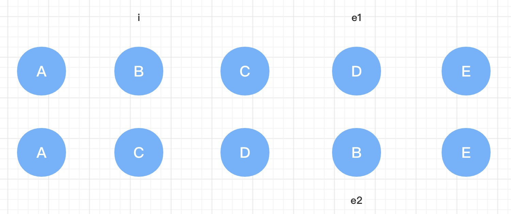

> 为了更加清楚理解源码的意义，代码的顺序做了调整  

<!-- TOC -->

- [processElement](#processelement)
- [mountElement](#mountelement)
- [mountChildren](#mountchildren)
- [patchElement](#patchelement)
- [patchProps](#patchprops)
- [patchChildren](#patchchildren)
- [patchKeyedChildren](#patchkeyedchildren)
    - [第一步: 处理头部相同的 vnode](#第一步-处理头部相同的-vnode)
    - [第二步: 处理尾部相同的 vnode](#第二步-处理尾部相同的-vnode)
    - [第三步 处理连续新增节点](#第三步-处理连续新增节点)
    - [第四步 处理连续删除节点](#第四步-处理连续删除节点)
    - [第五步 处理剩余情况( 移动，非连续的新增、删除 )](#第五步-处理剩余情况-移动非连续的新增删除-)
        - [keyToNewIndexMap](#keytonewindexmap)
        - [newIndexToOldIndexMap](#newindextooldindexmap)
        - [如何知道 vnode 发生了移动](#如何知道-vnode-发生了移动)
        - [遍历老 vnode](#遍历老-vnode)
        - [获取最长稳定子序列](#获取最长稳定子序列)
        - [遍历未被 patch 的 vnode](#遍历未被-patch-的-vnode)

<!-- /TOC -->

# processElement  
这个函数是元素节点的入口函数，用来处理元素的挂载或更新，只会被调用在 [patch](#patch) 函数内  

```typescript
const processElement = (
    n1: VNode | null,
    n2: VNode,
    container: RendererElement,
    anchor: RendererNode | null,
    parentComponent: ComponentInternalInstance | null,
    parentSuspense: SuspenseBoundary | null,
    isSVG: boolean,
    optimized: boolean
) => {
    isSVG = isSVG || (n2.type as string) === 'svg'

    if (n1 == null) {
        // 不存在老节点，说明是第一次渲染，进行挂载
        mountElement(
            n2,
            container,
            anchor,
            parentComponent,
            parentSuspense,
            isSVG,
            optimized
        )
    } else {
        // 非第一次渲染，且新旧节点属于相同节点，处理新老节点
        patchElement(n1, n2, parentComponent, parentSuspense, isSVG, optimized)
    }
}
```  

# mountElement  
这个函数用来挂载一个新元素节点，并追加到容器节点中，并且会处理一些 `hooks`（ 包括 `vnode`、指令 ）  

```typescript
const mountElement = (
    vnode: VNode,
    container: RendererElement,
    anchor: RendererNode | null,
    parentComponent: ComponentInternalInstance | null,
    parentSuspense: SuspenseBoundary | null,
    isSVG: boolean,
    optimized: boolean
) => {
    let el: RendererElement                     // 保存 vnode 对应的真实 DOM 节点
    let vnodeHook: VNodeHook | undefined | null // 保存 vnode 上的 hooks
    const {
        type,
        props,
        shapeFlag,
        transition,
        scopeId,
        patchFlag,
        dirs
    } = vnode

    if (
        !__DEV__ &&
        vnode.el &&
        hostCloneNode !== undefined &&
        patchFlag === PatchFlags.HOISTED
    ) {
        // If a vnode has non-null el, it means it's being reused.
        // Only static vnodes can be reused, so its mounted DOM nodes should be
        // exactly the same, and we can simply do a clone here.
        // only do this in production since cloned trees cannot be HMR updated.
        el = vnode.el = hostCloneNode(vnode.el)
    } else {
        // 创建真实 DOM 节点并挂载到 vnode 的 el 上
        el = vnode.el = hostCreateElement(
            vnode.type as string,
            isSVG,
            props && props.is
        )

        // 处理子节点
        if (shapeFlag & ShapeFlags.TEXT_CHILDREN) {
            // 子节点为文本节点，例如 <span>hello</span>
            // 设置 DOM 节点的子节点
            hostSetElementText(el, vnode.children as string)
        } else if (shapeFlag & ShapeFlags.ARRAY_CHILDREN) {
            // 子节点为数组，例如 <div><span>hello</span></div>
            // 挂载所有的子节点到新创建的 el DOM 节点上
            mountChildren(
                vnode.children as VNodeArrayChildren,   // 所有的子 children vnode
                el,                                     // 容器节点为新创建的节点，会将所有的子 vnode 挂载到 el 上
                null,                                   // 兄弟节点为 null，挂载的时候依次按照顺序增加
                parentComponent,
                parentSuspense,
                isSVG && type !== 'foreignObject',
                optimized || !!vnode.dynamicChildren    // 如果存在需要追踪的动态子节点，则使用优化策略
            )
        }

        // 同步执行指令的 created 钩子
        if (dirs) {
            invokeDirectiveHook(vnode, null, parentComponent, 'created')
        }
        
        // 处理 props
        if (props) {
            // 遍历所有的 props 并排除内置 prop，将 prop 设置到真实节点 el 上
            for (const key in props) {
                if (!isReservedProp(key)) {
                    hostPatchProp(
                        el,
                        key,
                        null,
                        props[key],
                        isSVG,
                        vnode.children as VNode[],
                        parentComponent,
                        parentSuspense,
                        unmountChildren
                    )
                }
            }

            // 同步执行 vnode 的 beforeMount 钩子
            if ((vnodeHook = props.onVnodeBeforeMount)) {
                invokeVNodeHook(vnodeHook, parentComponent, vnode)
            }
        }
        
        // scopeId
        setScopeId(el, scopeId, vnode, parentComponent)
    }

    // 同步执行指令的 beforeMount 钩子
    if (dirs) {
        invokeDirectiveHook(vnode, null, parentComponent, 'beforeMount')
    }

    // #1583 For inside suspense + suspense not resolved case, enter hook should call when suspense resolved
    // #1689 For inside suspense + suspense resolved case, just call it
    const needCallTransitionHooks =
        (!parentSuspense || (parentSuspense && !parentSuspense.pendingBranch)) &&
        transition &&
        !transition.persisted
    if (needCallTransitionHooks) {
        transition!.beforeEnter(el)
    }

    // 已经处理完当前节点下的所有子节点和属性设置，所以可以将 el 插入到父节点 container 中，并插入在兄弟节点 anchor 之前
    hostInsert(el, container, anchor)

    // 处理 vnode 的 mounted 钩子、指令的 mounted 钩子
    // 因为这些 钩子 都需要异步执行，所以会将它们放入异步队列中，等待下一轮微任务
    if (
        (vnodeHook = props && props.onVnodeMounted) ||
        needCallTransitionHooks ||
        dirs
    ) {
        queuePostRenderEffect(() => {
            vnodeHook && invokeVNodeHook(vnodeHook, parentComponent, vnode)
            needCallTransitionHooks && transition!.enter(el)
            dirs && invokeDirectiveHook(vnode, null, parentComponent, 'mounted')
        }, parentSuspense)
    }
}
```  

# mountChildren  
挂载所有的子节点  

```typescript
const mountChildren: MountChildrenFn = (
    children,
    container,
    anchor,
    parentComponent,
    parentSuspense,
    isSVG,
    optimized,
    start = 0
) => {
    // 遍历所有的 children，对每一个 vnode 进行 patch 操作
    for ( let i = start; i < children.length; i++ ) {
        const child = (children[i] = optimized
            ? cloneIfMounted(children[i] as VNode)
            : normalizeVNode(children[i]))
        patch(
            null,             // 挂载，所以为 null
            child,
            container,        // 父节点
            anchor,
            parentComponent,
            parentSuspense,
            isSVG,
            optimized
        )
    }
}
```  

# patchElement  
这个函数用来更新一个元素节点，并且老 `vnode` 和 新 `vnode` 属于同一类型，大体来说就分为两步  
1. 处理 `props` 的变化  
2. 处理 `children` 的变化  

```typescript
const patchElement = (
    n1: VNode,
    n2: VNode,
    parentComponent: ComponentInternalInstance | null,
    parentSuspense: SuspenseBoundary | null,
    isSVG: boolean,
    optimized: boolean
) => {
    // 此时新老 vnode 属于相同的节点，所以新 vnode 可以复用老 vnode 的真实 DOM 节点
    const el = (n2.el = n1.el!)
    
    let { patchFlag, dynamicChildren, dirs } = n2
    
    // #1426 take the old vnode's patch flag into account since user may clone a
    // compiler-generated vnode, which de-opts to FULL_PROPS
    patchFlag |= n1.patchFlag & PatchFlags.FULL_PROPS

    // 获取老的 props 和新的 props
    const oldProps = n1.props || EMPTY_OBJ
    const newProps = n2.props || EMPTY_OBJ
    
    let vnodeHook: VNodeHook | undefined | null

    // 同步执行 vnode 的 beforeUpdate 钩子
    if ((vnodeHook = newProps.onVnodeBeforeUpdate)) {
        invokeVNodeHook(vnodeHook, parentComponent, n2, n1)
    }

    // 同步执行指令的 beforeUpdate 钩子
    if (dirs) {
        invokeDirectiveHook(n2, n1, parentComponent, 'beforeUpdate')
    }

    // 检测 vnode 上是否有动态的 props
    if (patchFlag > 0) {
        // 存在动态 props
        // the presence of a patchFlag means this element's render code was
        // generated by the compiler and can take the fast path.
        // in this path old node and new node are guaranteed to have the same shape
        // (i.e. at the exact same position in the source template)
        // 检测是否有动态 key 的 props，如果有则对所有的 props 进行处理
        if (patchFlag & PatchFlags.FULL_PROPS) {
            patchProps(
                el,
                n2,
                oldProps,
                newProps,
                parentComponent,
                parentSuspense,
                isSVG
            )
        }
        // 否则依次对 class、style 以及会变化的 prop 处理
        else {
            // 若存在动态的 class，则对 class 进行设置
            if (patchFlag & PatchFlags.CLASS) {
                if (oldProps.class !== newProps.class) {
                    hostPatchProp(el, 'class', null, newProps.class, isSVG)
                }
            }

            // 若存在动态的 style，则对 style 进行设置
            if (patchFlag & PatchFlags.STYLE) {
                hostPatchProp(el, 'style', oldProps.style, newProps.style, isSVG)
            }

            // 若具有除 class 和 style 之外的动态属性，这些属性都会被存储在 vnode 的动态属性 dynamicProps 上
            // 此时遍历 dynamicProps，如果旧值和新值不相同，则会对其进行设置
            if (patchFlag & PatchFlags.PROPS) {
                const propsToUpdate = n2.dynamicProps!
                for (let i = 0; i < propsToUpdate.length; i++) {
                    const key = propsToUpdate[i]
                    const prev = oldProps[key]
                    const next = newProps[key]
                    if (
                        next !== prev ||
                        (hostForcePatchProp && hostForcePatchProp(el, key))
                    ) {
                        hostPatchProp(
                            el,
                            key,
                            prev,
                            next,
                            isSVG,
                            n1.children as VNode[],
                            parentComponent,
                            parentSuspense,
                            unmountChildren
                        )
                    }
                }
            }
        }

        // 检测是否存在动态文本，且新旧两次文本不一致会进行更新
        if (patchFlag & PatchFlags.TEXT) {
            if (n1.children !== n2.children) {
                hostSetElementText(el, n2.children as string)
            }
        }
    } else if (!optimized && dynamicChildren == null) {
        // 不存在动态 key，也没有优化策略，也不存在动态子节点
        // 此时需要处理全部的 props
        patchProps(
            el,
            n2,
            oldProps,
            newProps,
            parentComponent,
            parentSuspense,
            isSVG
        )
    }

    const areChildrenSVG = isSVG && n2.type !== 'foreignObject'

    // 处理 children
    if (dynamicChildren) {
        // 存在动态 children，则只处理动态 children
        patchBlockChildren(
            n1.dynamicChildren!,
            dynamicChildren,
            el,
            parentComponent,
            parentSuspense,
            areChildrenSVG
        )
    } else if (!optimized) {
        // 不存在动态 children，也没有优化策略，则对全部子节点进行处理
        patchChildren(
            n1,
            n2,
            el,
            null,
            parentComponent,
            parentSuspense,
            areChildrenSVG
        )
    }

    // 如果以上两种情况都不满足，例如在更新 span 节点的时候，已经处于 div 的动态节点中，而且本身也没有动态子节点
    /**
     * <div><span>{{ name }}</span></div>
     */

    // 处理 vnode 的 updated 钩子，或者指令的 updated 钩子
    // 因为这两个钩子需要异步执行，所以需要将它们放入异步队列中，等待下一轮微任务执行
    if ((vnodeHook = newProps.onVnodeUpdated) || dirs) {
        queuePostRenderEffect(() => {
            vnodeHook && invokeVNodeHook(vnodeHook, parentComponent, n2, n1)
            dirs && invokeDirectiveHook(n2, n1, parentComponent, 'updated')
        }, parentSuspense)
    }
}
```  

# patchProps  
这个函数用来全量处理新老 `props` 的差异，并更新  

```typescript
const patchProps = (
    el: RendererElement,
    vnode: VNode,
    oldProps: Data,
    newProps: Data,
    parentComponent: ComponentInternalInstance | null,
    parentSuspense: SuspenseBoundary | null,
    isSVG: boolean
) => {
    if (oldProps !== newProps) {
        // 遍历新的 props，过滤掉内置 props 后，如果新 prop 和 旧 prop 的值不一致，就会对其进行更新
        // 或者新值和旧值相同，但是存在强制更新 hostForcePatchProp，那么也会更新 prop 的值
        for (const key in newProps) {
            if (isReservedProp(key)) continue
            const next = newProps[key]
            const prev = oldProps[key]
            if (
                next !== prev ||
                (hostForcePatchProp && hostForcePatchProp(el, key))
            ) {
                hostPatchProp(
                    el,
                    key,
                    prev,
                    next,
                    isSVG,
                    vnode.children as VNode[],
                    parentComponent,
                    parentSuspense,
                    unmountChildren
                )
            }
        }
        
        if (oldProps !== EMPTY_OBJ) {
            // 遍历老 props，如果 prop 只存在于老 props，不存在于新 props 中，那么需要将这个 prop 删除
            for (const key in oldProps) {
                if (!isReservedProp(key) && !(key in newProps)) {
                    hostPatchProp(
                        el,
                        key,
                        oldProps[key],
                        null,           // 新的值为 null，表示要删除
                        isSVG,
                        vnode.children as VNode[],
                        parentComponent,
                        parentSuspense,
                        unmountChildren
                    )
                }
            }
        }
    }
}
```  

# patchChildren  
这个函数用来比较新老 `children` 的入口函数  
首先会对 `Fragment` 进行处理  
1. 如果是有 `key` 的 `Fragment` 则会调用 [patchKeyedChildren](#patchKeyedChildren) 对新老 `children` 进行处理  
2. 如果是没有 `key` 的 `Fragment` 则会调用 [patchUnkeyedChildren](#patchUnkeyedChildren) 对新老 `children` 进行处理  

对于其他类型的 `vnode` 来说，`children` 无非就三种: 文本、数组以及 `null`，而这三种都是可以通过 [shapeFlag](#shapeFlag) 来区分的   

1. 新的是文本  
 * 旧的是数组 -> 卸载数组中的所有节点  
 * 新 `children` 和旧 `children` 不一致时，更新节点的子节点  

2. 新的不是文本( 列表/`null` )  
 * 旧的是数组  
    * 新的是数组 -> 新旧都是数组，通过 [patchKeyedChildren](#patchKeyedChildren) 依次比较每个节点  
    * 新的不是数组，不管新的是什么，直接卸载老 `children` 里的所有节点  
 * 旧的不是数组（ 文本/`null` ）  
    * 旧的是文本，将子节点内容清空  
      新的是数组 -> 通过 [mountChildren](#mountChildren) 挂载所有新的节点   

```typescript
const patchChildren: PatchChildrenFn = (
    n1,
    n2,
    container,
    anchor,
    parentComponent,
    parentSuspense,
    isSVG,
    optimized = false
) => {
    const c1 = n1 && n1.children
    const prevShapeFlag = n1 ? n1.shapeFlag : 0
    const c2 = n2.children

    const { patchFlag, shapeFlag } = n2
    // fast path
    if (patchFlag > 0) {
        if (patchFlag & PatchFlags.KEYED_FRAGMENT) {
            // this could be either fully-keyed or mixed (some keyed some not)
            // presence of patchFlag means children are guaranteed to be arrays
            patchKeyedChildren(
                c1 as VNode[],
                c2 as VNodeArrayChildren,
                container,
                anchor,
                parentComponent,
                parentSuspense,
                isSVG,
                optimized
            )
            return
        } else if (patchFlag & PatchFlags.UNKEYED_FRAGMENT) {
            // unkeyed
            patchUnkeyedChildren(
                c1 as VNode[],
                c2 as VNodeArrayChildren,
                container,
                anchor,
                parentComponent,
                parentSuspense,
                isSVG,
                optimized
            )
            return
        }
    }

    // children：text、array、none
    if (shapeFlag & ShapeFlags.TEXT_CHILDREN) {
        // now: text
        // text children fast path
        if (prevShapeFlag & ShapeFlags.ARRAY_CHILDREN) {
            // now: text
            // prev: array
            // 之前是列表节点，需要将列表节点卸载
            unmountChildren(c1 as VNode[], parentComponent, parentSuspense)
        }

        if (c2 !== c1) {
            // now: text
            // 当前是文本节点，如果和之前不相同，都需要重新设置内容
            hostSetElementText(container, c2 as string)
        }
    } else {
        // now: array | none

        if (prevShapeFlag & ShapeFlags.ARRAY_CHILDREN) {
        // now: array | none
        // prev: array

            if (shapeFlag & ShapeFlags.ARRAY_CHILDREN) {
                // now: array
                // prev: array
                // 两次都是列表，需要 diff
                patchKeyedChildren(
                    c1 as VNode[],
                    c2 as VNodeArrayChildren,
                    container,
                    anchor,
                    parentComponent,
                    parentSuspense,
                    isSVG,
                    optimized
                )
            } else {
                // now: none
                // prev: array
                // 没有子节点，仅需要卸载旧的列表节点
                unmountChildren(c1 as VNode[], parentComponent, parentSuspense, true)
            }
        } else {
            // now: array | none
            // prev: text | none

            if (prevShapeFlag & ShapeFlags.TEXT_CHILDREN) {
                // now: array | none
                // prev: text
                hostSetElementText(container, '')
            }

            if (shapeFlag & ShapeFlags.ARRAY_CHILDREN) {
                // now: array
                // prev: text | none
                // 如果现在的子节点是列表，则挂载列表节点
                mountChildren(
                    c2 as VNodeArrayChildren,
                    container,
                    anchor,
                    parentComponent,
                    parentSuspense,
                    isSVG,
                    optimized
                )
            }
        }
    }
}
``` 
      

# patchKeyedChildren  
这个函数就是用来比较老 `children` 和 新 `children` 的区别，并对每一个 `vnode` 进行 [patch](#patch) 操作，也就是实现了 `Diff` 的核心算法，总共有五个步骤  

## 第一步: 处理头部相同的 vnode  
从头开始，遍历新老 `children` 两个列表公共部分  
* 如果是相同的 `vnode` 则对其进行 `patch` 操作  
* 如果不是，则记录下 `vnode` 的索引 `i`，并结束遍历  
所以 `i` 就指向从头开始，第一个不相同 `vnode` 的索引  

## 第二步: 处理尾部相同的 vnode
从尾开始，遍历新老 `children` 两个列表  
* 如果是相同的 `vnode` 则对其进行 `patch` 操作  
* 如果不是，则分别记录下老 `children` 的索引 `e1` 和 新 `children` 的索引 `e2`，并结束遍历  
所以 `e1` 指向老 `children` 中，从后往前第一个不相同 `vnode` 的索引，`e2` 指向新 `children` 中，从后往前第一个不相同 `vnode` 的索引  

**经过前两步，已经 patch 了首尾相同的 vnode，在下面的步骤中，就不会再去处理这些已经 patch 过的 vnode 了，只会处理 [i, e1] 以及 [i,  e2] 范围的 vnode**  

```typescript
const l2 = c2.length    // 新 children 的长度
let i = 0               // 指向从前往后，第一个不相同 vnode 的指针
let e1 = c1.length - 1  // 指向老 children 中，从后往前，第一个不相同 vnode 的指针
let e2 = l2 - 1         // 指向新 children 中，从后往前，第一个不相同 vnode 的指针

// 第一步，遍历新老 children 公共部分（ 即 i 同时小于 e1 和 e2 ）
while (i <= e1 && i <= e2) {
    const n1 = c1[i]                // 从前往后获取老 vnode
    const n2 = (c2[i] = optimized   // 从前往后获取新 vnode
        ? cloneIfMounted(c2[i] as VNode)
        : normalizeVNode(c2[i]))
    if (isSameVNodeType(n1, n2)) {
        // 相同 vnode，进行 patch
        patch(
            n1,
            n2,
            container,
            null,
            parentComponent,
            parentSuspense,
            isSVG,
            optimized
        )
    } else {
        // 不同 vnode，直接退出遍历
        break
    }
    // 指针往后 + 1
    i++
}

// 第二步，遍历新老 children 公共部分（ 即 i 同时小于 e1 和 e2 ）
while (i <= e1 && i <= e2) {
    const n1 = c1[e1]               // 从后往前获取老 vnode
    const n2 = (c2[e2] = optimized  // 从后往前获取新 vnode
        ? cloneIfMounted(c2[e2] as VNode)
        : normalizeVNode(c2[e2]))
    if (isSameVNodeType(n1, n2)) {
        // 相同 vnode，进行 patch
        patch(
            n1,
            n2,
            container,
            null,
            parentComponent,
            parentSuspense,
            isSVG,
            optimized
        )
    } else {
        // 不同 vnode，直接退出遍历
        break
    }
    // 指针往前 - 1
    e1--
    e2--
}
```

## 第三步 处理连续新增节点  


## 第四步 处理连续删除节点  


## 第五步 处理剩余情况( 移动，非连续的新增、删除 )  
首先会定义两个指针，分别用于新老 children，且都是从 `i` 开始，也就是从第一个不相同的 `vnode` 开始，不会再处理已经 `patch` 过的 `vnode`，在接下来的遍历也是，只会遍历到 `e1` 或者 `e2`  

```typescript
const s1 = i    // 老 children 的指针
const s2 = i    // 新 children 的指针
```  

### keyToNewIndexMap  
这是一个 `Map` 对象，其中 `key` 是 `vnode.key`，而 `value` 是这个 `vnode` 在新 `children` 的位置索引  
这里会遍历新 `children` 去设置其中的值  

```typescript
const keyToNewIndexMap: Map<string | number, number> = new Map()
// 遍历新 children 中未 patch 的节点，即从 i 到 e2
for ( i = s2; i <= e2; i++ ) {
    const nextChild = (c2[i] = optimized
        ? cloneIfMounted(c2[i] as VNode)
        : normalizeVNode(c2[i]))
    if (nextChild.key != null) {
        if (__DEV__ && keyToNewIndexMap.has(nextChild.key)) {
            warn(
                `Duplicate keys found during update:`,
                JSON.stringify(nextChild.key),
                `Make sure keys are unique.`
            )
        }
        keyToNewIndexMap.set(nextChild.key, i)
    }
}
```  

这个变量的作用就是，在之后遍历老 `children` 的时候，可以直接根据 `key` 获取到同一个 `vnode` 在新 `children` 里的位置索引，从而去移动，如果获取不到，则说明这个 `vnode` 不存在于新 `children`，需要卸载  

### newIndexToOldIndexMap  
从名字上可以看出，这应该是一个 新索引 -> 老索引 的对象，而实际上却是一个数组，数组的下标是新索引，而值是老索引 + 1  
需要注意的是，数组里的元素和未被 `patch` 的 `vnode` 是一一对应的，所以数组的长度应该和未被 `patch` 的 `vnode` 个数一致，如下所示  


```typescript
// 没有经过 patch 的节点个数，即除了第一、二步 patch 的节点个数
const toBePatched = e2 - s2 + 1

// 初始化为未被 patch vnode 个数的数组
const newIndexToOldIndexMap = new Array(toBePatched)
// 初始值都为 0，0 表示在老 children 中是不存在的
// 在之后会遍历未被 patch 的 vnode，会判断 newIndexToOldIndexMap 里的值是否是 0
// 如果是 0，则表示这个 vnode 在老 children 不存在，所以需要新增
// 所以 newIndexToOldIndexMap 的值需要加 1，就是为了表示 0 是不存在的 vnode
for (i = 0; i < toBePatched; i++) newIndexToOldIndexMap[i] = 0
```  

而 `newIndexToOldIndexMap` 被赋值是在之后遍历老 `children` 的时候，为了方便说明，会在这里解释  

此时会遍历老 `children`，会根据 `vnode` 的 `key` 从 `keyToNewIndexMap` 取出在新 `children` 里的位置索引，标记为 `newIndex`，而此时 `i` 就是老 `vnode` 的位置索引  

```typescript
// newIndex 是当前旧 vnode 在新列表中从头开始计算的索引
// s2 是新列表中，第一个不相同 vnode 的索引，可以理解为是第一个未被 patch 的 vnode 从头开始计算的索引
// newIndex - s2 就是在未被 patch 列表里的索引，而不是从头开始的
newIndexToOldIndexMap[newIndex - s2] = i + 1
```  

### 如何知道 vnode 发生了移动  

> 以下示例中节点的 `key` 和就是自身的内容  

先看节点不会发生移动的情况  

旧: A B C  
新: A B C  

1. 遍历老的 `vnode` A，此时它在 新 `children` 里的索引是 0   
2. 遍历老的 `vnode` B，此时它在 新 `children` 里的索引是 1  
3. 遍历老的 `vnode` C，此时它在 新 `children` 里的索引是 2    

可以看到，当不发生移动时，新 `children` 的索引是依次递增的，即**新 `children` 里的索引只要是递增的，就没有发生移动**  

在看如果发生了移动的情况  

旧: A B C  
新: C A B  

1. 遍历老的 `vnode` A，此时它在 新 `children` 里的索引是 1  
2. 遍历老的 `vnode` B，此时它在 新 `children` 里的索引是 2  
3. 遍历老的 `vnode` C，此时它在 新 `children` 里的索引是 0  

可以看到，递增的情况被打断了，现在 C 的索引是 0，上一次 B 的索引是 2，反而降低了，由此可以说明，C 被移动了，而且还被移动到了 B 的前面  

在这个过程中，可以看到关键值就是 2，我们称这个值为 ”最大索引值“，如果后续发现，新的索引值 < 最大索引值，那么就说明这个 `vnode` 发生了移动  

### 遍历老 vnode  

```typescript
// 遍历未被 patch 的老 vnode，即从 s1 开始，一直到 e1 结束
for ( i = s1; i <= e1; i++ ) {
    // 获取老 vnode
    const prevChild = c1[i]
    
    if (patched >= toBePatched) {
        // all new children have been patched so this can only be a removal
        unmount(prevChild, parentComponent, parentSuspense, true)
        continue
    }

    // 获取老节点在新 children 中的索引
    let newIndex
    if (prevChild.key != null) {
        // 通过 key 的形式获取索引
        newIndex = keyToNewIndexMap.get(prevChild.key)
    } else {
        // 不存在 key，遍历新节点，如果和老节点是一个节点，且没有 patch 过，那么这个新节点的索引就是老节点即将渲染的索引
        for (j = s2; j <= e2; j++) {
            if (
                newIndexToOldIndexMap[j - s2] === 0 &&
                isSameVNodeType(prevChild, c2[j] as VNode)
            ) {
                newIndex = j
                break
            }
        }
    }

    if (newIndex === undefined) {
        // 老节点在新列表中没有位置，需要卸载
        unmount(prevChild, parentComponent, parentSuspense, true)
    } else {
        // 更新 newIndexToOldIndexMap 的值
        newIndexToOldIndexMap[newIndex - s2] = i + 1

        // 检测是否发生了移动，如果新索引 < 最大索引值，代表发生移动，标识 moved 为 true，否则更新 最大索引值
        if (newIndex >= maxNewIndexSoFar) {
            maxNewIndexSoFar = newIndex
        } else {
            moved = true
        }

        // patch 新老节点
        patch(
            prevChild,
            c2[newIndex] as VNode,
            container,
            null,
            parentComponent,
            parentSuspense,
            isSVG,
            optimized
        )
        // patch 个数 + 1
        patched++
    }
}
```  

### 获取最长稳定子序列  

通过 [getSequence](#getSequence) 函数，计算 [newIndexToOldIndexMap](#newIndexToOldIndexMap) 的最长稳定子序列，计算结果里，每个元素都是新 `children` 中稳定 `vnode` 的位置索引，并且该索引是从未被 `patch` 的列表开始计算的，即 `s2` 开始  
稳定 `vnode` 的意思就是不需要发生移动，和原来的位置一样  

```typescript
// 当有 vnode 移动时，计算稳定序列，否则就是空数组
const increasingNewIndexSequence = moved
    ? getSequence(newIndexToOldIndexMap)
    : EMPTY_ARR

// 指向稳定节点的指针，从后往前
let j = increasingNewIndexSequence.length - 1
```  

下面这个示例中的稳定子序列 `increasingNewIndexSequence` 就是 `[ 0, 1 ]`，代表了 C 和 D 是稳定的，不需要移动  

  

### 遍历未被 patch 的 vnode  
这是最后一步，在这一步中会去处理需要移动的 `vnode` 以及新增的 `vnode`  

```typescript
// 从后往前遍历未被 patch 的节点列表
for ( i = toBePatched - 1; i >= 0; i-- ) {
    // 现在 i 是在未被 patch 列表里的索引，而且是从后往前
    // s2 是新列表中，第一个不相同 vnode 的索引，可以理解为未被 patch 列表中，第一个元素从头开始计算的索引
    // s2 + i 就是，未被 patch 的 vnode，从头计算的索引，可以直接从新列表 c2 获取对应的 vnode
    const nextIndex = s2 + i
    // 从新列表获取需要新的 vnode
    const nextChild = c2[nextIndex] as VNode
    // 获取下一个兄弟节点，无论是新增还是插入，都需要在这个兄弟节点之前
    // 检测下一个索引是否存在于列表中，如果存在，则取下一个节点，否则取父 anchor
    // 因为是从后往前处理，所以 newIndex 之后的真实 DOM 节点已经和 c2 是一致的了，所以可以直接从 c2 里的 vnode 上获取真实 el 作为兄弟节点
    const anchor = nextIndex + 1 < l2
        ? (c2[nextIndex + 1] as VNode).el
        : parentAnchor

    // 如果 newIndexToOldIndexMap 中的元素为 0，说明旧列表中不存在，此时需要挂载
    if (newIndexToOldIndexMap[i] === 0) {
        patch(
            null,
            nextChild,
            container,
            anchor,
            parentComponent,
            parentSuspense,
            isSVG
        )
    } else if (moved) {
        // 发生移动，有两种情况需要移动节点
        if (
            j < 0 ||                            // 已经不存在稳定 vnode，只剩下需要移动的 vnode 了
            i !== increasingNewIndexSequence[j] // 当前 vnode 在未被 patch 节点里的索引 i，和稳定列表里的索引不相同，说明不是稳定 vnode，因为 i 和 j 都是从后往前的指针，所以这里可以直接判断 i 和 increasingNewIndexSequence[j]
        ) {
            move(nextChild, container, anchor, MoveType.REORDER)
        } else {
            // 当前节点是稳定节点，指针向前移动一位
            j--
        }
    }
}
```