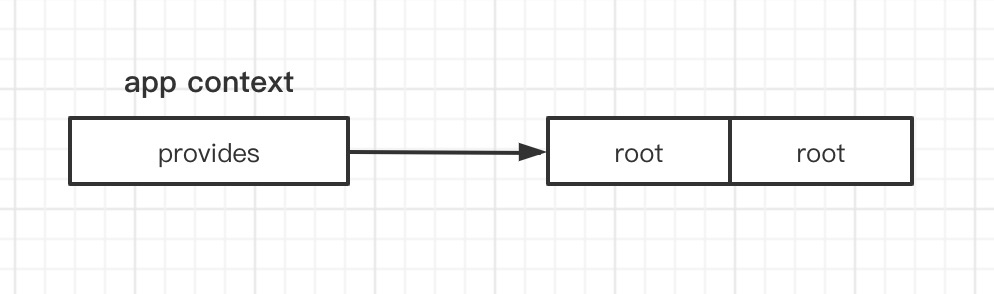
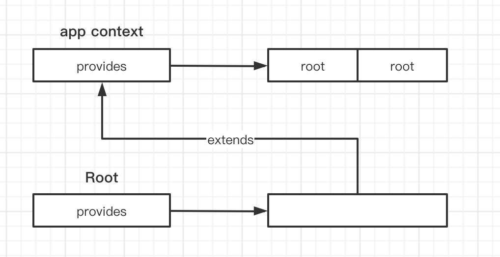
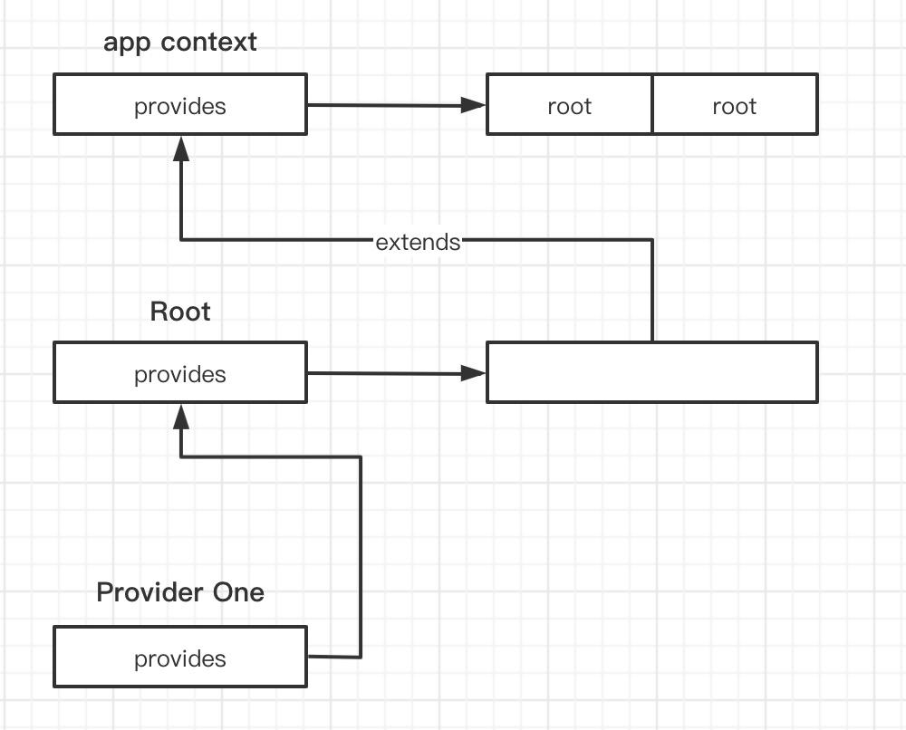
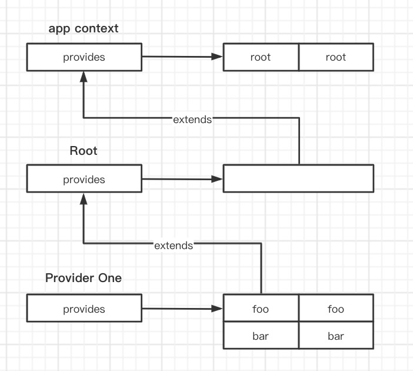
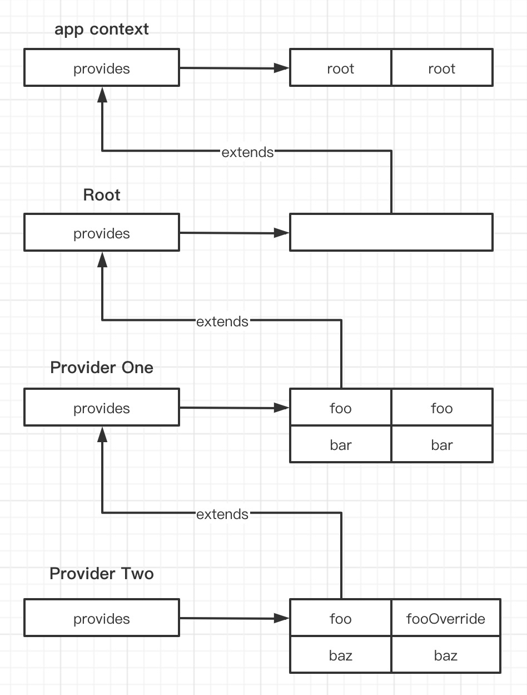
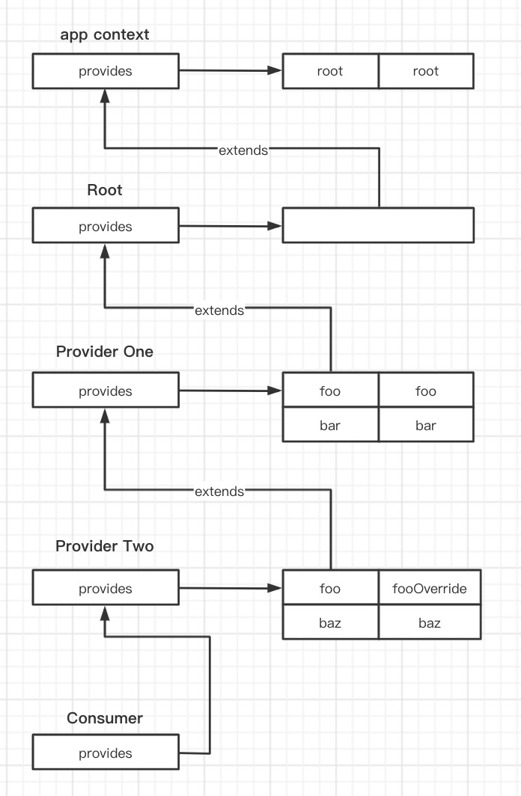

**为了更加清楚理解源码的意义，代码的顺序做了调整**  

<!-- TOC -->

- [provide](#provide)
- [inject](#inject)
- [示例](#示例)
    - [provides 继承流程](#provides-继承流程)
    - [function component](#function-component)

<!-- /TOC -->

# provide  
在一个组件内，通过 `provide` 可以为所有的子组件提供数据( 无论嵌套多少层子组件 )，但是 `provide` 必须在组件的 `setup` 函数中使用，否则会抛出警告  

每一个组件都会对应一个组件实例，而在每个组件实例上都会挂载 `app` 的 `context`，这个 `context` 是通过 `createAppContext` 方法产生的  

```typescript
export function createAppContext(): AppContext {
    return {
        app: null as any,
            config: {
            isNativeTag: NO,
            performance: false,
            globalProperties: {},
            optionMergeStrategies: {},
            isCustomElement: NO,
            errorHandler: undefined,
            warnHandler: undefined
        },
        mixins: [],
        components: {},
        directives: {},
        provides: Object.create(null)
    }
}
```  

可以看到，`context` 里的 `provides` 就是一个普通对象，并且不会继承任何属性。生成 `context` 后，会在调用 `createApp().mount()` 时将其挂载到根组件的 `vnode` 上  

```typescript
export function createAppAPI<HostElement>(
  render: RootRenderFunction,
  hydrate?: RootHydrateFunction
): CreateAppFunction<HostElement> {
    return function createApp(rootComponent, rootProps = null) {
        // 创建 app 的 context
        const context = createAppContext()

        // 创建 app 对象
        const app: App = (context.app = {
            mount(rootContainer: HostElement, isHydrate?: boolean): any {
                // 检查是否已经挂载
                if (!isMounted) {
                    // 创建根组件对应的 vnode
                    const vnode = createVNode(
                        rootComponent as ConcreteComponent,
                        rootProps
                    )
                    
                    // 将 app 的 context 挂载在根 vnode 上
                    vnode.appContext = context

                    // 标识已经挂载过
                    isMounted = true

                    /* ... */
                }
            },

            provide(key, value) {
                // 验证 key 是否重复
                if (__DEV__ && (key as string | symbol) in context.provides) {
                    warn(
                        `App already provides property with key "${String(key)}". ` +
                        `It will be overwritten with the new value.`
                    )
                }
                // 将提供的 key 和 value 存入 context.provides 中
                context.provides[key as string] = value

                return app
            }
        })

        return app
    }
}
```  

在创建组件实例时，每个实例的 `context` 来源会有两个
1. 如果是根组件，那么就会取 `vnode` 上的 `appContext`
2. 如果不是根组件，那么就会取父组件的 `appContext`  

由此可以看到，在整个应用中，每个组件实例的 `appContext` 其实都指向的是 `app` 里的 `context` 这个对象  
而对于每个组件的 `provides` 也一样，指向 `app.context.provides`，但是如果在组件中使用了 `provide` 函数，那么就会打破这个关系，后面会看到   

```typescript
export function createComponentInstance (
    vnode: VNode,
    parent: ComponentInternalInstance | null,
    suspense: SuspenseBoundary | null
) {
    // 每个组件继承父组件的 context，如果是根组件，则从 vnode 上获取，根节点的 vnode 会在 mount 时挂载 context
    const appContext = (parent ? parent.appContext : vnode.appContext) || emptyAppContext

    const instance: ComponentInternalInstance = {
        /* ... */
        appContext,
        // provides 继承自父组件，如果是根组件的话，会继承 context 中的 provides
        provides: parent ? parent.provides : Object.create(appContext.provides),
        /* ... */
    }
}
```  

接下来看 `provide` 函数的实现，该函数只能用在某一个组件的 `setup` 内调用  

```typescript
export function provide<T>(key: InjectionKey<T> | string, value: T) {
    // 检验是否在 setup 函数内
    if (!currentInstance) {
        if (__DEV__) {
            warn(`provide() can only be used inside setup().`)
        }
    } else {
        // 获取组件本身的 providers
        let provides = currentInstance.provides
        
        // 获取父组件的 provides
        const parentProvides = currentInstance.parent && currentInstance.parent.provides

        // 检测当前组件和父组件的 provides 是否相等
        // 默认情况下，在生成组件实例时，组件的 provides 都会和父组件指向同一个 provides，所以肯定相等
        // 而既然我们在某个组件里使用了 provide 函数，那么提供的这个数据应该只能被加到当前组件中，而不能影响父组件
        // 所以此时我们需要将当前组件的 provides 指向一个新的对象，并且还需要保证能访问到父组件中的数据，所以需要继承父组件的 provides
        if (parentProvides === provides) {
            provides = currentInstance.provides = Object.create(parentProvides)
        }

        // 将提供的数据加到当前组件的 provides 中
        provides[key as string] = value
    }
}
```  

# inject  
`provide` 用于提供数据，而 `inject` 用于获取数据，并且还可以提供获取不到时的默认值  

```typescript
/**
 * 获取 provide 提供的数据
 * @param { InjectionKey<any> | string } key 数据的 key
 * @param { any } defaultValue key 不存在时的默认值
 * @param { boolean } treatDefaultAsFactory 是否将默认值是为函数
 */
export function inject(
    key: InjectionKey<any> | string,
    defaultValue?: unknown,
    treatDefaultAsFactory = false
) {
    // 获取当前正在渲染的组件，当前组件可以是状态组件，也可以是函数组件
    const instance = currentInstance || currentRenderingInstance

    if (instance) {
        // 获取组件本身的 provides
        const provides = instance.provides
        
        // 检测 key 是否存在于 provides，会一直向上检测
        if ((key as string | symbol) in provides) {
            return provides[key as string]
        } else if (arguments.length > 1) {  // 检测是否存在第二个参数
            // 如果存在，则判断 treatDefaultAsFactory 是否为 true，并且 defaultValue 是函数
            return treatDefaultAsFactory && isFunction(defaultValue)
                ? defaultValue()
                : defaultValue
        } else if (__DEV__) {
            warn(`injection "${String(key)}" not found.`)
        }
    } else if (__DEV__) {
        warn(`inject() can only be used inside setup() or functional components.`)
    }
}
```

# 示例  
## provides 继承流程  

```typescript
const Root = {
    render () {
        return h( ProviderOne )
    }
}

const ProviderOne = {
    setup() {
        provide('foo', 'foo')
        provide('bar', 'bar')
        return () => h(ProviderTwo)
    }
}

const ProviderTwo = {
    setup() {
        provide('foo', 'fooOverride')
        provide('baz', 'baz')
        return () => h(Consumer)
    }
}

const Consumer = {
    setup() {
        const foo = inject('foo')
        const bar = inject('bar')
        const baz = inject('baz')
        const root = inject('root')
        return () => [foo, bar, baz, root].join(',')
    }
}

const app = createApp( Root )

app.provide( 'root', 'root' );

app.mount( document.querySelector( '#root' ) )
```  

1. 首先通过 `createApp` 生成 `app.context`，并且通过 `app.provide` 向 `app.context.provides` 增加 `root` 数据  

    

2. 生成 `Root` 组件的实例时，它没有父组件，所以它的 `provides` 仅仅是一个继承 `app.context.provides` 的新对象  

    

3. 生成 `ProviderOne` 组件的实例时，由于存在父组件，所以它的 `provides` 和父组件指向同一个对象  

      

    到执行 `setup` 中的 `provide` 时，由于父组件和当前组件的 `provides` 指向同一对象，所以会重写当前组件的 `provides`  

    

4. 生成 `ProviderTwo` 和 `ProviderOne` 的过程一模一样  

      

5. 最后生成 `Comsumer` 组件，它的 `provides` 和父组件指向同一个  

      

    现在，通过 `inject`，可以在这条链路上依次找到 `foo`、`bar`、`baz` 和 `root`，且先找到先使用，所以最终的结果就是 `fooOverride,bar,baz,root`  

## function component  
在函数组件中使用 `inject`，也是可以获取到数据的  

```typescript
const Provider = {
    setup () {
        provide( 'foo', 'foo1' );
        return () => h( Consumer )
    }
}

const Consumer = () => {
    const foo = inject( 'foo' );
    return foo;
}

const app = createApp( Provider )

app.mount( document.querySelector( '#app' ) )
```  

最终渲染出来的就是 `foo1`