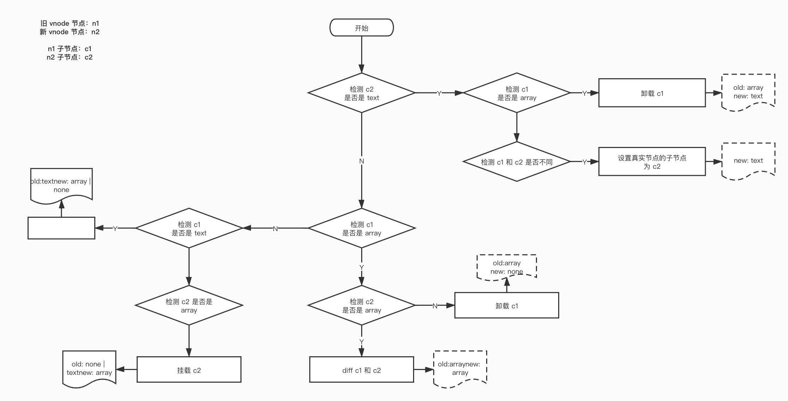
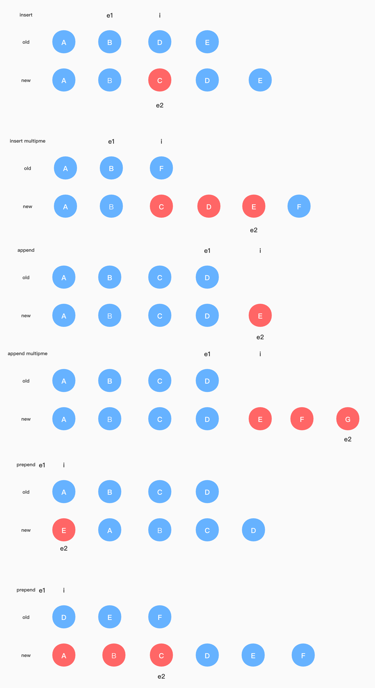
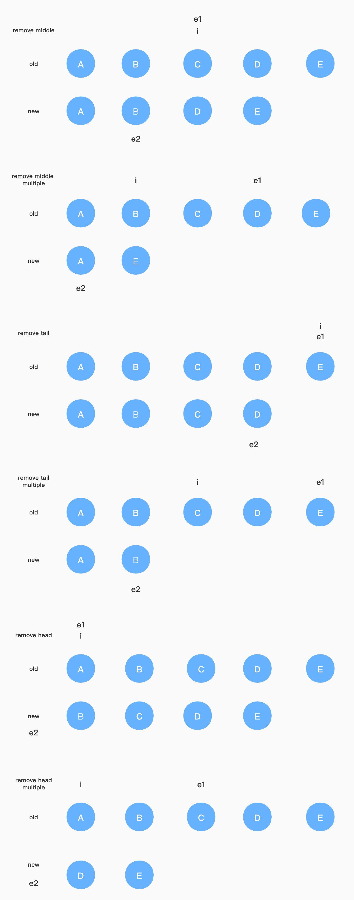
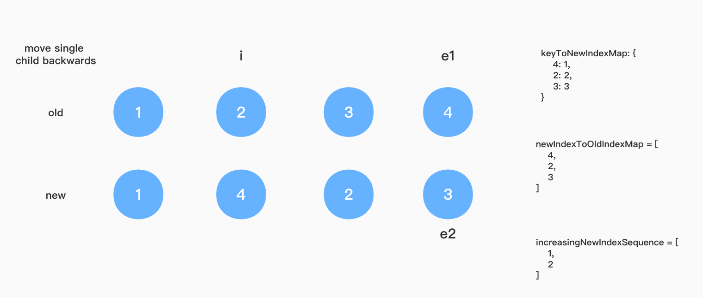

**为了更加清楚理解源码的意义，代码的顺序做了调整**  

<!-- TOC -->

- [公用变量](#公用变量)
    - [isReservedProp](#isreservedprop)
- [渲染器](#渲染器)
    - [参数](#参数)
- [patch](#patch)
- [执行操作方法](#执行操作方法)
    - [process前置说明](#process前置说明)
    - [processElement](#processelement)
    - [processText](#processtext)
- [挂载阶段](#挂载阶段)
    - [mountElement](#mountelement)
    - [mountChildren](#mountchildren)
- [对比方法](#对比方法)
    - [patchElement](#patchelement)
    - [patchProps](#patchprops)
    - [patchChildren](#patchchildren)
    - [patchKeyedChildren](#patchkeyedchildren)
        - [处理其他情况](#处理其他情况)

<!-- /TOC -->

# 公用变量  
## isReservedProp  
这个变量存储的是 Vue 内置的 prop，遇到这些 prop 的时候，并不会对其进行处理（ 设置真实节点的属性 ）  

```typescript
const isReservedProp = /*#__PURE__*/ makeMap(
    'key,ref,' +
    'onVnodeBeforeMount,onVnodeMounted,' +
    'onVnodeBeforeUpdate,onVnodeUpdated,' +
    'onVnodeBeforeUnmount,onVnodeUnmounted'
)
```  

解析后如下  
```typescript
const isReservedProp = {
    key: true,
    ref: true,
    onVnodeBeforeMount: true,
    onVnodeMounted: true,
    onVnodeBeforeUpdate: true,
    onVnodeUpdated: true,
    onVnodeBeforeUnmount: true,
    onVnodeUnmounted: true,
}
```  

# 渲染器  
Vue3.0 支持自定义渲染器，用来在不同平台上进行节点的渲染，首先需要创建一个渲染器，并且提供在不同平台上操作节点的一系列函数，具体如下  

```typescript
export function createRenderer<
    HostNode = RendererNode,
    HostElement = RendererElement
>(options: RendererOptions<HostNode, HostElement>) {
    return baseCreateRenderer<HostNode, HostElement>(options)
}
```  

```typescript
function baseCreateRenderer (
    options: RendererOptions,
    createHydrationFns?: typeof createHydrationFunctions
) {
    // 获取不同平台下对节点的操作
    const {
        insert: hostInsert,                             // 插入
        remove: hostRemove,                             // 移除
        patchProp: hostPatchProp,                       // 设置 props
        createElement: hostCreateElement,               // 创建元素节点
        createText: hostCreateText,                     // 创建文本节点
        createComment: hostCreateComment,               // 创建注释节点
        setText: hostSetText,                           // 设置属性节点
        setElementText: hostSetElementText,             // 设置节点文本内容
        parentNode: hostParentNode,                     // 获取父界节点
        nextSibling: hostNextSibling,                   // 获取下一个兄弟节点
        setScopeId: hostSetScopeId = NOOP,              
        cloneNode: hostCloneNode,                       // 克隆节点
        insertStaticContent: hostInsertStaticContent    
    } = options

    // 接下来定义了一系列的操作方法  
    
    const patch = ( /**/ ) => { /**/ }
    const patchElement = ( /**/ ) => { /**/ }
    const patchBlockChildren = ( /**/ ) => { /**/ }
    const patchProps = ( /**/ ) => { /**/ }
    const patchChildren = ( /**/ ) => { /**/ }
    const patchUnkeyedChildren = ( /**/ ) => { /**/ }
    const patchKeyedChildren = ( /**/ ) => { /**/ }

    const processElement = ( /**/ ) => { /**/ }
    const processText = ( /**/ ) => { /**/ }
    const processCommentNode = ( /**/ ) => { /**/ }
    const processFragment = ( /**/ ) => { /**/ }
    const processComponent = ( /**/ ) => { /**/ }

    const mountElement = ( /**/ ) => { /**/ }
    const mountChildren = ( /**/ ) => { /**/ }
    const mountComponent = ( /**/ ) => { /**/ }
    const mountStaticNode = ( /**/ ) => { /**/ }

    const unmount = ( /**/ ) => { /**/ }
    const unmountChildren = ( /**/ ) => { /**/ }
    const unmountComponent = ( /**/ ) => { /**/ }

    const updateComponent = ( /**/ ) => { /**/ }
    const updateComponentPreRender = ( /**/ ) => { /**/ }

    const setupRenderEffect = ( /**/ ) => { /**/ }

    const setRef = ( /**/ ) => { /**/ }

    const getNextHostNode = ( /**/ ) => { /**/ }

    const move = ( /**/ ) => { /**/ }

    const remove = ( /**/ ) => { /**/ }
    const removeFragment = ( /**/ ) => { /**/ }

    const render = ( /**/ ) => { /**/ }

    return {
        render,
        hydrate,
        createApp: createAppAPI(render, hydrate)
    }
}
```  

## 参数  
对于上面的几个操作内，基本都有共同的参数，接下来统一说明参数的意义，在每一次渲染都会调用，所以存在 “第一次” 和 “非第一次” 两种情况  

1. `n1`: 老节点，是一个 `vNode` 对象，如果是第一次则为 `null`  
2. `n2`: 新节点，是一个 `vNode` 对象  
3. `container`: 父节点，是一个真实的节点，如果在浏览器环境就是 `DOM` 节点，如果当前渲染的是根节点，那么它就是容器节点，如果当前渲染的是某个子节点，那么它就是父节点  
4. `anchor`: 在插入节点会用到  
    如果它不存在，插入的时候会把 `n2` 对应的真实节点插入到 `container` 内最后一个，如果它存在，则会插入到 `anchor` 前面  

# patch  
这个方法是处理节点的入口方法，无论是否是第一次渲染都需要由这个方法开始。它主要做三件事  
1. 如果此时不一次渲染，检查新老节点是否是相同节点，如果不是，则卸载老节点，接下来走挂载新节点的流程（ 相当于第一次渲染 ）  
2. 针对不同的新节点类型，调用不同的 [执行操作方法](#执行操作方法) 来完成  
3. 设置 `ref`  

```typescript
const patch: PatchFn = (
    n1,
    n2,
    container,
    anchor = null,
    parentComponent = null,
    parentSuspense = null,
    isSVG = false,
    optimized = false
) => {
    // 检测新旧节点是否相同
    if (n1 && !isSameVNodeType(n1, n2)) {
        // 新旧节点不相同
        anchor = getNextHostNode(n1)
        // 卸载旧节点
        unmount(n1, parentComponent, parentSuspense, true)
        // 新旧节点不相同，设置 n1 为 null，接下来走挂载新节点的流程
        n1 = null
    }

    const { type, ref, shapeFlag } = n2

    // 检测新节点类型，不同类型有不同的处理方法，处理方法都是以 process 开头
    switch (type) {
        case Text:      // 文本节点
            processText(n1, n2, container, anchor)
            break
        case Comment:   // 注释节点
            processCommentNode(n1, n2, container, anchor)
            break
        case Static:    // 静态节点
            if (n1 == null) {
                mountStaticNode(n2, container, anchor, isSVG)
            } // static nodes are noop on patch
            break
        case Fragment:  // Fragment 节点
            processFragment(
                n1,
                n2,
                container,
                anchor,
                parentComponent,
                parentSuspense,
                isSVG,
                optimized
            )
            break
        default:
            if (shapeFlag & ShapeFlags.ELEMENT) { // 元素节点
                processElement(
                    n1,
                    n2,
                    container,
                    anchor,
                    parentComponent,
                    parentSuspense,
                    isSVG,
                    optimized
                )
            } else if (shapeFlag & ShapeFlags.COMPONENT) {  // 组件
                processComponent(
                    n1,
                    n2,
                    container,
                    anchor,
                    parentComponent,
                    parentSuspense,
                    isSVG,
                    optimized
                )
            } else if (shapeFlag & ShapeFlags.TELEPORT) {   // Telport
                ;(type as typeof TeleportImpl).process(
                    n1,
                    n2,
                    container,
                    anchor,
                    parentComponent,
                    parentSuspense,
                    isSVG,
                    optimized,
                    internals
                )
            } else if (__FEATURE_SUSPENSE__ && shapeFlag & ShapeFlags.SUSPENSE) { // Suspense
                ;(type as typeof SuspenseImpl).process(
                    n1,
                    n2,
                    container,
                    anchor,
                    parentComponent,
                    parentSuspense,
                    isSVG,
                    optimized,
                    internals
                )
            }
    }

    // 设置 ref
    if (ref != null && parentComponent) {
        const refValue = shapeFlag & ShapeFlags.STATEFUL_COMPONENT
            ? n2.component!.proxy
            : n2.el;
        setRef(ref, n1 && n1.ref, parentComponent, refValue)
    }
}
```

# 执行操作方法  
执行操作方法都是以 `process` 开头，是处理节点的入口函数，但具体是第一次渲染（ 需要挂载 ），还是非第一次渲染（ 需要比较新老节点的差异 ），则会由其他函数执行，`process` 函数里通常只做一个判断  

## process前置说明  
下面几个 `process` 方法都是在 [patch](#patch) 函数内部调用的，而在 [patch](#patch) 内一开始，就会判断新老节点是否属于同一节点  
如果不属于同一节点，那么会将 `n1` 设置为 `null`，代表本次渲染的是一个新的节点，没有老节点，所以之后 `process` 内都会走挂载流程（ 即第一次渲染 ）  
例如，上一次渲染的是  

```markdown
<ul>
    <li>item 0</li>
    <li>item 1</li>
    <li>item 2</li>
</ul>
```  

而本次渲染的是  

```markdown
<div>
    <span>hello</span>
</div>
```  

如果属于同一节点，之后的 `process` 内会走更新流程，而且更新流程内是可以直接复用老的真实节点的，因为它们的节点类型一致  

## processElement  
这个方法只在 [patch](#patch) 内调用，用于处理当前渲染的是一个 **元素节点**  

```typescript
const processElement = (
    n1: VNode | null,
    n2: VNode,
    container: RendererElement,
    anchor: RendererNode | null,
    parentComponent: ComponentInternalInstance | null,
    parentSuspense: SuspenseBoundary | null,
    isSVG: boolean,
    optimized: boolean
) => {
    // TODO
    // 检测当前渲染的节点是否是 svg 节点
    isSVG = isSVG || ( n2.type as string ) === 'svg';

    if (n1 == null) {
      // 不存在老节点，说明是第一次渲染，进行挂载
      mountElement(
        n2,
        container,
        anchor,
        parentComponent,
        parentSuspense,
        isSVG,
        optimized
      );
    } else {
      // 非第一次渲染，进行 patchElement 新老节点
      patchElement( n1, n2, parentComponent, parentSuspense, isSVG, optimized );
    }
}
```  

## processText  
这个方法只在 [patch](#patch) 内调用，用于处理当前渲染的是一个 **文本节点**  

```typescript
type ProcessTextOrCommentFn = (
    n1: VNode | null,
    n2: VNode,
    container: RendererElement,
    anchor: RendererNode | null
) => void
const processText: ProcessTextOrCommentFn = ( n1, n2, container, anchor ) => {
    if ( n1 == null ) {
        // 不存在老节点，第一次渲染，需要挂载
        // 在不同平台下，创建文本节点，并挂载 vnode 的 el 上
        // 在不同平台下，将创建的文本节点插入父节点中
        hostInsert(
            (n2.el = hostCreateText( n2.children as string )),
            container,
            anchor
        )
    } else {
        // ①
        // 非第一次渲染，因为文本节点只有内容，没有其他的 props，所以不需要额外的处理，只管里面的内容
        // 所以直接复用老的真实节点，而且只有文本内容不一致时，才会更新真实节点的内容为新的内容
        const el = (n2.el = n1.el!)
        if ( n2.children !== n1.children ) {
            // 如果文本内容不相同，则重新设置文本
            hostSetText( el, n2.children as string )
        }
    }
}
```  

① 处直接复用老节点的原因可以参考 [process前置说明](#process前置说明)  

# 挂载阶段  

## mountElement  
这个函数用来创建元素节点，并挂载到父元素上，只有在 [processElement](#processElement) 内部才会调用，所以有两种情况  
1. 当前渲染的节点是第一次  
2. 当前渲染的节点不是第一次，而且老节点和新节点不是同一类型的节点，参考 [process前置说明](#process前置说明)  

```typescript
const mountElement = (
    vnode: VNode,                                       // 即将挂载的新节点
    container: RendererElement,
    anchor: RendererNode | null,
    parentComponent: ComponentInternalInstance | null,
    parentSuspense: SuspenseBoundary | null,
    isSVG: boolean,
    optimized: boolean
) => {
    let el: RendererElement
    let vnodeHook: VNodeHook | undefined | null
    // 获取新节点的相关属性
    const {
        type,
        props,
        shapeFlag,
        transition,
        scopeId,
        patchFlag,
        dirs
    } = vnode

    if (
      vnode.el &&
      hostCloneNode !== undefined &&
      patchFlag === PatchFlags.HOISTED
    ) {
        el = vnode.el = hostCloneNode( vnode.el )
    } else {
        // 创建各个平台中的真实节点并挂载到 vnode 的 el 上
        el = vnode.el = hostCreateElement(
            vnode.type as string,
            isSVG,
            props && props.is
        );

        // 处理 props
        if (props) {
            for (const key in props) {
                // 过滤掉 isReservedProp 中的属性
                if (!isReservedProp(key)) {
                    // 在不同平台下，设置真实节点的各个属性值
                    hostPatchProp(el, key, null, props[key], isSVG)
                }
            }

            // 处理 before mount 钩子
            if ((vnodeHook = props.onVnodeBeforeMount)) {
                invokeVNodeHook(vnodeHook, parentComponent, vnode)
            }
        }

        if (dirs) {
            invokeDirectiveHook(vnode, null, parentComponent, 'beforeMount')
        }

        if (scopeId) {
            hostSetScopeId(el, scopeId)
        }

        const treeOwnerId = parentComponent && parentComponent.type.__scopeId

        if (treeOwnerId && treeOwnerId !== scopeId) {
            hostSetScopeId(el, treeOwnerId + '-s')
        }

        // 处理子节点
        if (shapeFlag & ShapeFlags.TEXT_CHILDREN) {
            // 子节点是文本，例如 <div>hello</div>
            // 在不同平台上，将真实节点 el 的内容设置为该文本
            hostSetElementText(el, vnode.children as string)
        } else if (shapeFlag & ShapeFlags.ARRAY_CHILDREN) {
            ①
            // 子节点是列表，例如 <div><span>hello</span></div>
            // 挂载所有的子节点到新创建的 el 节点
            mountChildren(
                vnode.children as VNodeArrayChildren,
                el,
                null,
                parentComponent,
                parentSuspense,
                isSVG && type !== 'foreignObject',
                optimized || !!vnode.dynamicChildren
            )
        }

        if (transition && !transition.persisted) {
            transition.beforeEnter(el)
        }
    }

    // 此时，已经将 el 的 props，以及子节点都挂载到了 el 上，所以调用不同平台的插入操作，将 el 插入到 container 中
    hostInsert(el, container, anchor)

    if (
        (vnodeHook = props && props.onVnodeMounted) ||
        (transition && !transition.persisted) ||
        dirs
    ) {
        queuePostRenderEffect(() => {
            vnodeHook && invokeVNodeHook(vnodeHook, parentComponent, vnode)
            transition && !transition.persisted && transition.enter(el)
            dirs && invokeDirectiveHook(vnode, null, parentComponent, 'mounted')
        }, parentSuspense)
    }
    
}
```  

1. ① 处调用 `mountChildren` 时，第二个参数是真实节点 `el`，所以在 `mountChildren` 内调用 `patch` 时，都会将子节点挂载到 `el` 上  
第三个参数（ 即 `anchor` ）传递的是 `null`，那么这些子节点会依次追加到 `el` 里的最后一个，保证和原始列表顺序一致，不会发生在某个节点中间插入的情况  

## mountChildren  
这个函数用来挂载子节点列表  

```typescript
const mountChildren: MountChildrenFn = (
    children,
    container,
    anchor,
    parentComponent,
    parentSuspense,
    isSVG,
    optimized,
    start = 0
) => {
    // 遍历子节点列表
    for (let i = start; i < children.length; i++) {
        // 获取当前子节点的 vnode，根据是否优化有两种获取方式
        const child = (children[i] = optimized
            ? cloneIfMounted(children[i] as VNode)
            : normalizeVNode(children[i]))

        // ① 
        // 对每个子节点进行 patch 操作
        patch(
            null,
            child,
            container,
            anchor,
            parentComponent,
            parentSuspense,
            isSVG,
            optimized
        )
    }
}
```  

1. ① 处调用 `patch` 时，第一个参数（ 老节点 ）传递的是 `null`，也就代表这是一个新的节点，需要挂载  

# 对比方法  

## patchElement  
这个方法只会在 [processElement](#processElement) 内调用，且新老节点属于同一类型的节点  

```typescript
const patchElement = (
    n1: VNode,
    n2: VNode,
    parentComponent: ComponentInternalInstance | null,
    parentSuspense: SuspenseBoundary | null,
    isSVG: boolean,
    optimized: boolean
) => {
    // 此时新老 vnode 属于相同的节点，所以可以复用老的真实节点
    const el = (n2.el = n1.el!)
    // 获取新节点的相关属性
    let { patchFlag, dynamicChildren, dirs } = n2
    // 获取新老节点的 props
    const oldProps = (n1 && n1.props) || EMPTY_OBJ
    const newProps = n2.props || EMPTY_OBJ
    let vnodeHook: VNodeHook | undefined | null

    // 处理 before update 钩子
    if ((vnodeHook = newProps.onVnodeBeforeUpdate)) {
        invokeVNodeHook(vnodeHook, parentComponent, n2, n1)
    }
    
    if (dirs) {
        invokeDirectiveHook(n2, n1, parentComponent, 'beforeUpdate')
    }

    if (patchFlag > 0) {

    } else if (!optimized && dynamicChildren == null) {
        // 未优化，需要全量对比 props
        patchProps(
            el,
            n2,
            oldProps,
            newProps,
            parentComponent,
            parentSuspense,
            isSVG
        )
    }

    const areChildrenSVG = isSVG && n2.type !== 'foreignObject'

    if (dynamicChildren) {

    } else if (!optimized) {
        // 未优化，全量比较 children
        patchChildren(
            n1,
            n2,
            el,
            null,
            parentComponent,
            parentSuspense,
            areChildrenSVG
        )
    }

    // 处理 updated 钩子
    if ((vnodeHook = newProps.onVnodeUpdated) || dirs) {
        queuePostRenderEffect(() => {
            vnodeHook && invokeVNodeHook(vnodeHook, parentComponent, n2, n1)
            dirs && invokeDirectiveHook(n2, n1, parentComponent, 'updated')
        }, parentSuspense)
    }
}
```  

## patchProps  
这个方法只会在 [patchElement](#patchElement) 中调用，所以新老节点是可以复用的，用来比较前后两次渲染 `props` 的变化，并设置到真实节点 `el`  

```typescript
const patchProps = (
    el: RendererElement,                                // 复用的老节点 
    vnode: VNode,                                       // 新的 vnode
    oldProps: Data,                                     // 老节点的 props
    newProps: Data,                                     // 新节点的 props
    parentComponent: ComponentInternalInstance | null,
    parentSuspense: SuspenseBoundary | null,
    isSVG: boolean
) => {
    // 如果前后两次 props 没有变化，则不作任何处理
    if (oldProps !== newProps) {
        // 遍历新的 props
        for (const key in newProps) {
            // 过滤内置 prop
            if (isReservedProp(key)) continue
            const next = newProps[key]
            const prev = oldProps[key]
            // 同一 prop 前后两次不相同，则设置真实节点的属性值
            if (next !== prev) {
                hostPatchProp(
                    el,
                    key,
                    prev,
                    next,
                    isSVG,
                    vnode.children as VNode[],
                    parentComponent,
                    parentSuspense,
                    unmountChildren
                )
            }
        }

        if (oldProps !== EMPTY_OBJ) {
            // 遍历老的 props
            for (const key in oldProps) {
                // 过滤内置 prop 以及不属于新的 props
                if (!isReservedProp(key) && !(key in newProps)) {
                    hostPatchProp(
                        el,
                        key,
                        oldProps[key],
                        null,
                        isSVG,
                        vnode.children as VNode[],
                        parentComponent,
                        parentSuspense,
                        unmountChildren
                    )
                }
            }
        }
    }
}
```  

## patchChildren  
这个方法用于比较子节点的差异，调用场景有两个 
1. 当前渲染不是第一次，且新节点和旧节点属于同一节点，还处于非优化模式  

```typescript
const patchChildren: PatchChildrenFn = (
    n1,
    n2,
    container,          // 复用的真实节点
    anchor,
    parentComponent,
    parentSuspense,
    isSVG,
    optimized = false
) => {
    const c1 = n1 && n1.children                    // 获取老的子节点
    const prevShapeFlag = n1 ? n1.shapeFlag : 0     // 获取老节点的 shapeFlag
    const c2 = n2.children                          // 获取新的子节点
    const { patchFlag, shapeFlag } = n2             // 获取新节点的 shapeFlag 和 patchFlag

    if (patchFlag === PatchFlags.BAIL) {
        optimized = false
    }

    if (patchFlag > 0) {
        if (patchFlag & PatchFlags.KEYED_FRAGMENT) {
            // this could be either fully-keyed or mixed (some keyed some not)
            // presence of patchFlag means children are guaranteed to be arrays
            patchKeyedChildren(
                c1 as VNode[],
                c2 as VNodeArrayChildren,
                container,
                anchor,
                parentComponent,
                parentSuspense,
                isSVG,
                optimized
            )
            return
        } else if (patchFlag & PatchFlags.UNKEYED_FRAGMENT) {
            // unkeyed
            patchUnkeyedChildren(
                c1 as VNode[],
                c2 as VNodeArrayChildren,
                container,
                anchor,
                parentComponent,
                parentSuspense,
                isSVG,
                optimized
            )
            return
        }
    }

    // 开始检测 老子节点 和 新子节点 的类型
    // 子节点共有三种类型，文本(text)，列表(array)，没有(none)
    if (shapeFlag & ShapeFlags.TEXT_CHILDREN) {
        // now: text
 
        if (prevShapeFlag & ShapeFlags.ARRAY_CHILDREN) {
            // now: text
            // prev: array
            // 现在是文本节点，之前是列表节点，需要将列表节点卸载
            unmountChildren(c1 as VNode[], parentComponent, parentSuspense)
        }

        if (c2 !== c1) {
            // now: text
            // 当前是文本节点，如果和之前不相同，都需要重新设置内容
            hostSetElementText(container, c2 as string)
        }
    } else {
        // now: array | none

        if (prevShapeFlag & ShapeFlags.ARRAY_CHILDREN) {
            // now: array | none
            // prev: array

            if (shapeFlag & ShapeFlags.ARRAY_CHILDREN) {
                // now: array
                // prev: array
                // 新旧两次都是列表，需要 diff 比较
                patchKeyedChildren(
                    c1 as VNode[],
                    c2 as VNodeArrayChildren,
                    container,
                    anchor,
                    parentComponent,
                    parentSuspense,
                    isSVG,
                    optimized
                )
            } else {
                // now: none
                // prev: array
                // 现在没有子节点，仅需要卸载旧的列表节点
                unmountChildren(c1 as VNode[], parentComponent, parentSuspense, true)
            }
        } else {
            // now: array | none
            // prev: text | none

            if (prevShapeFlag & ShapeFlags.TEXT_CHILDREN) {
                // now: array | none
                // prev: text
                hostSetElementText(container, '')
            }

            if (shapeFlag & ShapeFlags.ARRAY_CHILDREN) {
                // now: array
                // prev: text | none
                // 如果现在是列表，而之前不是，则挂载列表节点
                mountChildren(
                    c2 as VNodeArrayChildren,
                    container,
                    anchor,
                    parentComponent,
                    parentSuspense,
                    isSVG,
                    optimized
                )
            }
        }
    }
}
```  

这个方法的流程图可以参照下面  

  

可以看出来，这个方法主要的目的就是对新老子节点的差异进行了处理    

## patchKeyedChildren  
这个方法主要就是对 **新老子节点列表** 寻找差异并解决的方法，也就是 Vue3.0 实现 diff 的逻辑  
总共有 5 个步骤，会对 新列表 中的每一个节点进行 [patch](#patch) 操作，能复用老节点就复用，不能就新建，总共有五个步骤
1. 从头开始遍历 新老子节点 公共的部分，并 `patch` 每个节点，直至第一个不相同的节点为止，会记录下从头开始第一个不相同节点的索引 `i`  
2. 如果第一步没有 `patch` 完全部的节点，再从尾开始遍历 新老子节点 公共的部分，并 `patch` 每个节点，直至第一个不相同的节点为止，会记录下从尾开始第一个不相同节点的索引，老节点是 `e1` 新节点是 `e2`   
3. 处理连续新增的节点，这种情况对几个值的理解  
    `i` 可以理解为增加的起始下标(因为它是第一个不相同的索引，所以需要从这里开始增加)  
    `e2` 可以理解为增加的终止下标(因为 `e2` 是新列表中最后一个不相同的节点，在旧列表中从 `i` 到 `e2` 都是不存在的，所以一直要增加到 `e2` 对应位置的节点，包括 `i` 和 `e2`)  
    所以需要同时满足两个条件
      * `i > e1`
      * “待插入节点的索引” 要比 “新插入节点的最后一个索引” 小或相等，即 `i <= e2`
    
    
4. 处理连续删除的节点，这种情况对几个值的理解  
    `i` 可以理解为删除的起始下标(因为它是第一个不相同的索引，所以需要从这里开始删除)  
    `e1` 可以理解为删除的终止下标(因为 `e1` 是旧列表中最后一个不相同的节点，在新列表中从 `i` 到 `e1` 都是不存在的，所以一直要删到 `e1` 对应位置的节点，包括 `i` 和 `e1`)  
    所以需要同时满足两个条件  
      * “开始删除的下标” 要比 “最后一个删除的节点索引” 小或相等，即 `i <= e1`  
      * `i > e2`  
      
    
5. 处理其他情况，参照 [处理其他情况](#处理其他情况)  

下面是前 4 步的代码  

```typescript
const patchKeyedChildren = (
    c1: VNode[],
    c2: VNodeArrayChildren,
    container: RendererElement,
    parentAnchor: RendererNode | null,
    parentComponent: ComponentInternalInstance | null,
    parentSuspense: SuspenseBoundary | null,
    isSVG: boolean,
    optimized: boolean
) => {
    let i = 0              // 头索引
    const l2 = c2.length   // 新子节点的长度
    let e1 = c1.length - 1 // 老节点中尾索引
    let e2 = l2 - 1        // 新节点中尾索引

    // 1. 从头开始遍历
    while (i <= e1 && i <= e2) {
        const n1 = c1[i]                     // 旧 vnode 节点
        const n2 = (c2[i] = optimized        // 新 vnode 节点，根据是否优化有两种获取方式
            ? cloneIfMounted(c2[i] as VNode)
            : normalizeVNode(c2[i]))
        if (isSameVNodeType(n1, n2)) {
            // 如果新旧两个节点属于同一类型节点，进行 patch 操作，从头开始检查新节点是否能复用，不能就新建
            patch(
                n1,
                n2,
                container,
                parentAnchor,
                parentComponent,
                parentSuspense,
                isSVG,
                optimized
            )
        } else {
            // 如果不是同一类型节点，直接退出循环
            break
        }
        // 如果是节点类型相同，将头索引往后移一位，最终处于从头开始第一个不相同的索引
        i++
    }

    // 2. 从尾开始遍历
    while (i <= e1 && i <= e2) {
        const n1 = c1[e1]                       // 旧 vnode 节点
        const n2 = (c2[e2] = optimized          // 新 vnode 节点，根据是否优化有两种获取方式
            ? cloneIfMounted(c2[e2] as VNode)
            : normalizeVNode(c2[e2]))
        if (isSameVNodeType(n1, n2)) {
            // 如果新旧两个节点属于同一类型节点，进行 patch 操作，从头开始检查新节点是否能复用，不能就新建
            patch(
                n1,
                n2,
                container,
                parentAnchor,
                parentComponent,
                parentSuspense,
                isSVG,
                optimized
            )
        } else {
            // 如果不是同一类型节点，直接退出循环
            break
        }
        // 如果是节点类型相同，将两个尾索引往前移一位
        // 最终 e1 处于旧节点中，从后往前第一个不相同的索引，e2 处于新节点中，从后往前第一个不相同的索引
        e1--
        e2--
    }

    if (i > e1) {
        // 从前开始第一个不相同的节点索引 <= 新节点从后开始第一个不相同的节点索引
        if (i <= e2) {
            // 存在新插入的节点，接下来要创建对应的 vnode 以及真实节点 
            const nextPos = e2 + 1
            const anchor = nextPos < l2 ? (c2[nextPos] as VNode).el : parentAnchor
            while (i <= e2) {
                patch(
                    null,
                    (c2[i] = optimized
                        ? cloneIfMounted(c2[i] as VNode)
                        : normalizeVNode(c2[i])),
                    container,
                    anchor,
                    parentComponent,
                    parentSuspense,
                    isSVG
                )
                i++
            }
        }
    } else if (i > e2) {
      while (i <= e1) {
        unmount(c1[i], parentComponent, parentSuspense, true)
        i++
      }
    } else {
        // 处理其他情况
    }
}
```

### 处理其他情况  

**以下代码都在 patchKeyedChildren 里的最后一个 else 内**  

可以参照这个示例  

  

1. 定义变量  

    ```typescript
    const s1 = i // prev starting index
    const s2 = i // next starting index

    let j
    let patched = 0
    // 没有经过 patch 的节点个数
    const toBePatched = e2 - s2 + 1
    // 是否有移动过节点
    let moved = false
    // used to track whether any node has moved
    let maxNewIndexSoFar = 0
    ```  

    在前面两个 `while` 循环中，会把首尾相同的节点 `patch`，这里 `toBePatched` 会记录还没有 `patch` 的节点个数，就是

2. 遍历新列表中没有 `patch` 的节点，将每个子节点的 `key` 以及 新的索引 存储在 `Map` 对象 `keyToNewIndexMap` 中，在之后遍历老节点的时候会根据 `key` 直接获取最新一次渲染的索引位置  

    ```typescript
    const keyToNewIndexMap: Map<string | number, number> = new Map()
    for (i = s2; i <= e2; i++) {
        // 根据是否优化，来获取新节点的 vnode
        const nextChild = (c2[i] = optimized
            ? cloneIfMounted(c2[i] as VNode)
            : normalizeVNode(c2[i]))
        if (nextChild.key != null) {
            keyToNewIndexMap.set(nextChild.key, i)
        }
    }
    ```  

3. 定义 `newIndexToOldIndexMap` 数组，使用没有被 `patch` 的节点个数初始化，且都为 `0`，其中 `index` 是新节点的索引，`value` 是旧节点的索引，在之后会设置   

    ```typescript
    const newIndexToOldIndexMap = new Array(toBePatched)
    for (i = 0; i < toBePatched; i++) newIndexToOldIndexMap[i] = 0
    ```  

4. 遍历老子节点列表  
    a. 获取老节点在最新一次渲染的索引位置 `newIndex`
      * 如果老节点存在 `key`，那么就从 `keyToNewIndexMap` 里根据 `key` 获取最新索引  
      * 如果老节点不存在 `key`   
      
    b. 检测获取到的 `newIndex` 是否有效  
      * 如果为 `undefiend`，则说明这个老节点在最新一次渲染已经被删除了，所以现在需要卸载老节点  
      * 否则需要更新 `newIndexToOldIndexMap`  
        其中，它的索引是这样计算的：此时 `newIndex - s2` 就是基于第一个不相同的节点开始的索引值，而不是从头开始（ 因为 `newIndexToOldIndexMap` 的长度只有未被 `patch` 的节点个数而不是全部，所以这里设置的时候也只能算未被 `patch` 的节点索引 ）  
        而它的值是这样计算的：此时 `i` 是从头开始的索引值，所以它的值就是从头开始的索引值 + 1    
        所以示例中的 `newIndexToOldIndexMap` 就是 `[ 4, 2, 3 ]`
        

        ```typescript
        // 遍历没有 patch 过的老节点列表
        for (i = s1; i <= e1; i++) {
            const prevChild = c1[i]
            if (patched >= toBePatched) {
                // all new children have been patched so this can only be a removal
                unmount(prevChild, parentComponent, parentSuspense, true)
                continue
            }

            // 获取当前老节点在最新一次渲染中的索引位置
            let newIndex
            if (prevChild.key != null) {
                // 通过 key 的形式获取索引
                newIndex = keyToNewIndexMap.get(prevChild.key)
            } else {
                // 不存在 key
                // 遍历新节点，如果和老节点是一个节点，且没有 patch 过，那么这个新节点的索引就是老节点即将渲染的索引
                for (j = s2; j <= e2; j++) {
                    if (
                        newIndexToOldIndexMap[j - s2] === 0 &&
                        isSameVNodeType(prevChild, c2[j] as VNode)
                    ) {
                        newIndex = j
                        break
                    }
                }
            }

            // 检测老节点是否还存在最新一次渲染中
            if (newIndex === undefined) {
                // 老节点不存在索引位置，需要卸载
                unmount(prevChild, parentComponent, parentSuspense, true)
            } else {
                // 更新当前节点的 新索引 和 老索引
                newIndexToOldIndexMap[newIndex - s2] = i + 1
                if (newIndex >= maxNewIndexSoFar) {
                    maxNewIndexSoFar = newIndex
                } else {
                    moved = true
                }
                patch(
                    prevChild,
                    c2[newIndex] as VNode,
                    container,
                    null,
                    parentComponent,
                    parentSuspense,
                    isSVG,
                    optimized
                )
                patched++
            }
        }
        ```  

5. 接下来会根据 `newIndexToOldIndexMap` 生成最长稳定子序列 `increasingNewIndexSequence`  
   所谓 “稳定” 就是指，这个节点的位置不会发生变化，所以之后只需要移动不稳定的节点即可  
   在 `increasingNewIndexSequence` 中，`value` 指的是稳定节点的索引( 该索引是从 `i` 开始计算的 )

   ```typescript
    const increasingNewIndexSequence = moved
        ? getSequence(newIndexToOldIndexMap)
        : EMPTY_ARR
    // 稳定子序列长度，如果每个节点都不稳定，就不会生成子序列（ 长度为 0 ）
    j = increasingNewIndexSequence.length - 1
   ```

6. 再从后往前遍历新列表中未 `patch` 的节点  
   * 检测节点是否是创建的新节点，检测的依据就是根据节点索引从 `newIndexToOldIndexMap` 获取值，看是否是 `0`，因为 `newIndexToOldIndexMap` 里面的值只有在遍历老节点的时候才会被设置，如果为 `0` 就代表是新创建的节点  
   * 如果不是新创建的节点，再检测最新一次渲染是否发生了移动（ 注意，这里并不是检测具体的节点是否发生了移动，只要有任意一个节点移动即可 ）  
      1. 如果有任意一节点发生了移动，会有两种情况才会真正的移动某一个具体的节点  
          * 没有生成稳定子序列，说明每个节点都是不稳定的，所以每一个节点都需要移动，检测方法就是判断 `newIndexToOldIndexMap` 的长度，如果没有生成，长度就是 `0`   
          * 生成了稳定子序列，检查当前节点是否稳定，稳定就不会移动，不稳定才会移动  

    <br />  
    
    ```typescript
    // 从后往前遍历未被 patch 的节点
    for (i = toBePatched - 1; i >= 0; i--) {
        const nextIndex = s2 + i                    // 节点索引
        const nextChild = c2[nextIndex] as VNode    // 新节点 vnode
        const anchor = nextIndex + 1 < l2 ? (c2[nextIndex + 1] as VNode).el : parentAnchor
        
        if (newIndexToOldIndexMap[i] === 0) {
            // 挂载新节点
            patch(
                null,
                nextChild,
                container,
                anchor,
                parentComponent,
                parentSuspense,
                isSVG
            )
        } else if (moved) {
            if (j < 0 || i !== increasingNewIndexSequence[j]) {
                // 移动节点，只会有两种情况
                //   没有稳定序列，每一个节点都需要移动
                //   有稳定序列，但当前节点不稳定，需要移动
                move(nextChild, container, anchor, MoveType.REORDER)
            } else {
                // 当前节点稳定，不需要移动
                j--
            }
        }
    }
    ```  
