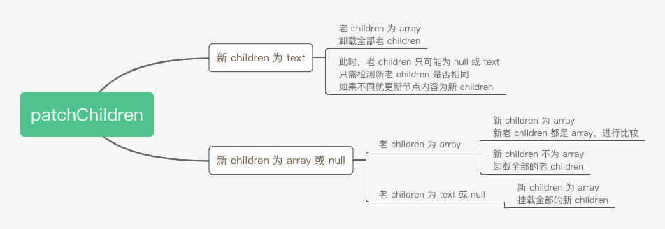
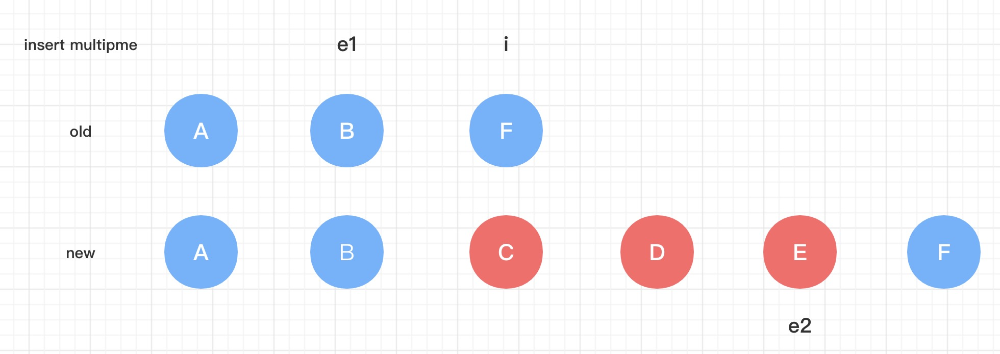
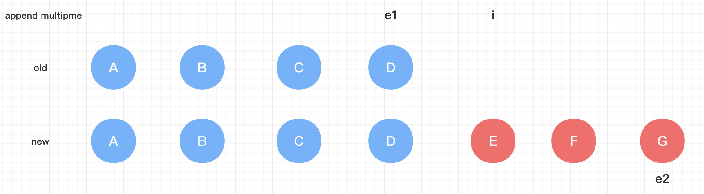
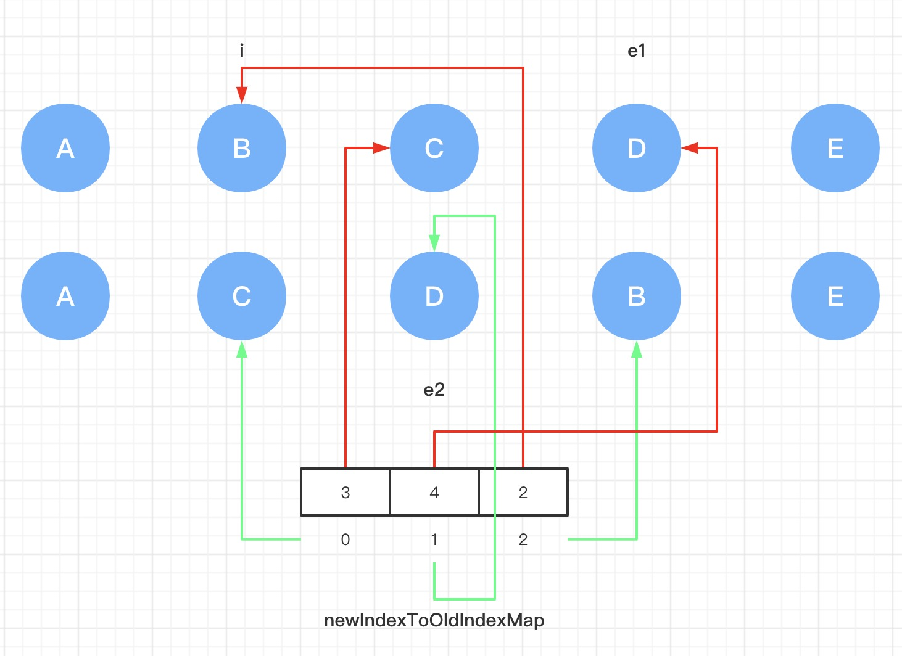
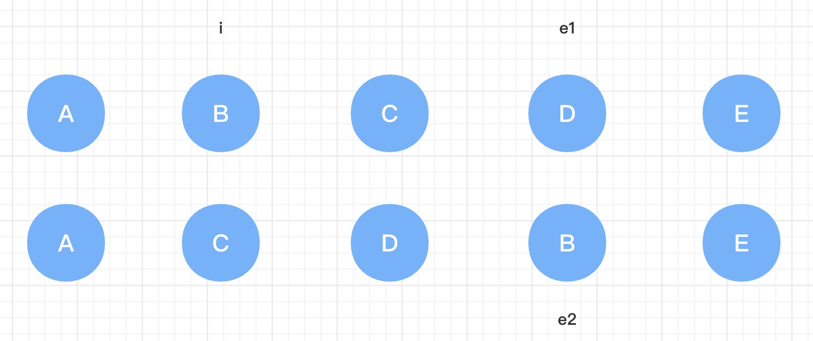

> 为了更加清楚理解源码的意义，代码的顺序做了调整  

<!-- TOC -->

- [patchChildren](#patchchildren)
- [patchBlockChildren](#patchblockchildren)
- [patchUnkeyedChildren](#patchunkeyedchildren)
- [patchKeyedChildren](#patchkeyedchildren)
    - [第一步: 处理头部相同的 vnode](#第一步-处理头部相同的-vnode)
    - [第二步: 处理尾部相同的 vnode](#第二步-处理尾部相同的-vnode)
    - [第三步 处理连续新增节点](#第三步-处理连续新增节点)
        - [示例](#示例)
            - [从中间插入](#从中间插入)
            - [从尾部插入](#从尾部插入)
    - [第四步 处理连续删除节点](#第四步-处理连续删除节点)
    - [第五步 处理剩余情况( 移动，非连续的新增、删除 )](#第五步-处理剩余情况-移动非连续的新增删除-)
        - [keyToNewIndexMap](#keytonewindexmap)
        - [newIndexToOldIndexMap](#newindextooldindexmap)
        - [如何知道 vnode 发生了移动](#如何知道-vnode-发生了移动)
        - [遍历老 vnode](#遍历老-vnode)
        - [获取最长稳定子序列](#获取最长稳定子序列)
        - [遍历未被 patch 的 vnode](#遍历未被-patch-的-vnode)
    - [示例](#示例-1)
        - [带有 key 移动节点](#带有-key-移动节点)
        - [不带有 key 移动节点](#不带有-key-移动节点)

<!-- /TOC -->

# patchChildren  
这个函数是用来比较新老 `children` 的入口函数，会处理两种类型的节点   
1. `Fragment`：会对 `KEYED_FRAGMENT` 以及 `UNKEYED_FRAGMENT` 这两种 `Fragment` 特殊处理  
2. 其他节点，`children` 无非就三种: 文本、数组以及 `null`，而这三种都是可以通过 [shapeFlag](#shapeFlag) 来区分的   

大致步骤如图所示  

  

```typescript
const patchChildren: PatchChildrenFn = (
    n1,
    n2,
    container,
    anchor,
    parentComponent,
    parentSuspense,
    isSVG,
    optimized = false
) => {
    const c1 = n1 && n1.children
    const prevShapeFlag = n1 ? n1.shapeFlag : 0
    const c2 = n2.children

    const { patchFlag, shapeFlag } = n2
    
    // 1. 处理 Fragment 的更新
    if (patchFlag > 0) {
        if (patchFlag & PatchFlags.KEYED_FRAGMENT) {
            // ①. KEYED_FRAGMENT 的 Fragment 使用 patchKeyedChildren 处理 children
            patchKeyedChildren(
                c1 as VNode[],
                c2 as VNodeArrayChildren,
                container,
                anchor,
                parentComponent,
                parentSuspense,
                isSVG,
                optimized
            )
            return
        } else if (patchFlag & PatchFlags.UNKEYED_FRAGMENT) {
            // ②. UNKEYED_FRAGMENT 的 Fragment 使用 patchUnkeyedChildren 处理 children
            patchUnkeyedChildren(
                c1 as VNode[],
                c2 as VNodeArrayChildren,
                container,
                anchor,
                parentComponent,
                parentSuspense,
                isSVG,
                optimized
            )
            return
        }
    }

    // 2. 处理其他节点，children 无非就三种类型：text、array、none
    if (shapeFlag & ShapeFlags.TEXT_CHILDREN) {
        // now: text
        // text children fast path
        if (prevShapeFlag & ShapeFlags.ARRAY_CHILDREN) {
            // now: text
            // prev: array
            // 之前是列表节点，需要将列表节点卸载，使用非优化，会将所有的子节点都卸载
            unmountChildren(c1 as VNode[], parentComponent, parentSuspense)
        }

        // 此时直接判断新旧 children 是否相同，旧 children 唯一需要卸载的时机就是为数组，上面已经处理过了
        if (c2 !== c1) {
            // now: text
            // 当前是文本节点，如果和之前不相同，都需要重新设置内容
            hostSetElementText(container, c2 as string)
        }
    } else {
        // now: array | none

        if (prevShapeFlag & ShapeFlags.ARRAY_CHILDREN) {
        // now: array | none
        // prev: array

            if (shapeFlag & ShapeFlags.ARRAY_CHILDREN) {
                // now: array
                // prev: array
                // 两次都是列表，需要 diff
                patchKeyedChildren(
                    c1 as VNode[],
                    c2 as VNodeArrayChildren,
                    container,
                    anchor,
                    parentComponent,
                    parentSuspense,
                    isSVG,
                    optimized
                )
            } else {
                // now: none
                // prev: array
                // 没有子节点，仅需要卸载旧的列表节点
                unmountChildren(c1 as VNode[], parentComponent, parentSuspense, true)
            }
        } else {
            // now: array | none
            // prev: text | none

            if (prevShapeFlag & ShapeFlags.TEXT_CHILDREN) {
                // now: array | none
                // prev: text
                hostSetElementText(container, '')
            }

            if (shapeFlag & ShapeFlags.ARRAY_CHILDREN) {
                // now: array
                // prev: text | none
                // 如果现在的子节点是列表，则挂载列表节点
                mountChildren(
                    c2 as VNodeArrayChildren,
                    container,
                    anchor,
                    parentComponent,
                    parentSuspense,
                    isSVG,
                    optimized
                )
            }
        }
    }
}
```  

# patchBlockChildren  
这个函数用来比较新老动态 `children`，只会在两个地方被调用  
1. 在更新一个元素节点 [patchElement](https://github.com/linhaotxl/frontend/blob/master/packages/vue/runtime-core/renderer/element/update/README.md#patchelement) 时，如果存在动态 `children` 就会被调用  
2. 在 [processFragment](https://github.com/linhaotxl/frontend/blob/master/packages/vue/runtime-core/renderer/fragment/README.md#processFragment) 里更新 `PatchFlags.STABLE_FRAGMENT` 的 `Fragment` 节点时会被调用  

**只会更新动态 `children` 而不是全部 `children`**  

```typescript
const patchBlockChildren: PatchBlockChildrenFn = (
    oldChildren,        // 旧的动态 children 列表
    newChildren,        // 新的动态 children 列表
    fallbackContainer,
    parentComponent,
    parentSuspense,
    isSVG
) => {
    for (let i = 0; i < newChildren.length; i++) {
        const oldVNode = oldChildren[i] // 获取老节点
        const newVNode = newChildren[i] // 获取新节点

        // Determine the container (parent element) for the patch.
        // TODO:
        const container =
            // - In the case of a Fragment, we need to provide the actual parent
            // of the Fragment itself so it can move its children.
            oldVNode.type === Fragment ||
            // - In the case of different nodes, there is going to be a replacement
            // which also requires the correct parent container
            !isSameVNodeType(oldVNode, newVNode) ||
            // - In the case of a component, it could contain anything.
            oldVNode.shapeFlag & ShapeFlags.COMPONENT ||
            oldVNode.shapeFlag & ShapeFlags.TELEPORT
                ? hostParentNode(oldVNode.el!)!
                : // In other cases, the parent container is not actually used so we
                // just pass the block element here to avoid a DOM parentNode call.
                fallbackContainer

        patch(
            oldVNode,
            newVNode,
            container,
            null,
            parentComponent,
            parentSuspense,
            isSVG,
            true              // patch 动态节点时，始终会进行优化策略
        )
    }
}
```  

注意：
1. 在 `patch` 每个动态节点时，会使用优化模式，这样的话，在 [patchElement](https://github.com/linhaotxl/frontend/blob/master/packages/vue/runtime-core/renderer/element/update/README.md#patchElement) 中就只会处理动态 `children`，而不是全部 `children`，从而达到优化目的  
2. TODO: `patch` 的时候兄弟节点传的是 `null`，但是在 `patch` 的更新阶段中，这个 `anchor` 并没有被用到，只有在更新 `Suspense` 时会用到  

# patchUnkeyedChildren  
这个函数专门处理 `UNKEYED_FRAGMENT` 的 `Fragment` 的 `children`  

```typescript
const patchUnkeyedChildren = (
    c1: VNode[],
    c2: VNodeArrayChildren,
    container: RendererElement,
    anchor: RendererNode | null,
    parentComponent: ComponentInternalInstance | null,
    parentSuspense: SuspenseBoundary | null,
    isSVG: boolean,
    optimized: boolean
) => {
    c1 = c1 || EMPTY_ARR
    c2 = c2 || EMPTY_ARR
    const oldLength = c1.length                         // 老 children 的长度
    const newLength = c2.length                         // 新 children 的长度
    const commonLength = Math.min(oldLength, newLength) // 新老 children 最小长度

    let i
    // 从前往后遍历新老 children 公共部分，从头 patch 每一个 vnode
    // 这里并不会复用，如果同一个位置上的 vnode 类型不同，那么就会移除旧的，创建新的
    for (i = 0; i < commonLength; i++) {
        const nextChild = (c2[i] = optimized
            ? cloneIfMounted(c2[i] as VNode)
            : normalizeVNode(c2[i]))
        patch(
            c1[i],
            nextChild,
            container,
            null,
            parentComponent,
            parentSuspense,
            isSVG,
            optimized
        )
    }
    // 检测是否存在新增或删除的 vnode
    if (oldLength > newLength) {
        // 老 children 的数量 > 新 children 的数量，说明需要移除从 commonLength 开始的老 children
        unmountChildren(
            c1,
            parentComponent,
            parentSuspense,
            true,
            false,
            commonLength
        )
    } else {
        // 新 children 的数量 >= 老 children 的数量，说明需要挂载从 commonLength 开始的新 children
        mountChildren(
            c2,
            container,
            anchor,             // 此时，anchor 就是 Frgament 的 end anchor，所以会将新 children 都挂载搭配这之前
            parentComponent,
            parentSuspense,
            isSVG,
            optimized,
            commonLength
        )
    }
}
```  

可以看出，这个函数不会复用任何一个节点，不是卸载就是新增，所以会消耗很多性能  

注意：
1. 在 `patch` 公共部分时，第四个参数兄弟节点传的是 `null`，原理和 [patchBlockChildren](#patchBlockChildren) 中一致  
2. 在卸载老 `children` 时，第四个参数传 `true`，表示会立即移除节点  
    第五个参数为 `false`，表示时候用非优化模式，会将所有的子节点都卸载  

# patchKeyedChildren  
这个函数就是用来比较老 `children` 和 新 `children` 的区别，并对每一个 `vnode` 进行比较，也就是实现了 `Diff` 的核心算法，总共有五个步骤  

## 第一步: 处理头部相同的 vnode  
从头开始，遍历新老 `children` 两个列表公共部分  
* 如果是相同的 `vnode` 则对其进行 `patch` 操作  
* 如果不是，则记录下 `vnode` 的索引 `i`，并结束遍历  
所以 `i` 就指向从头开始，第一个不相同 `vnode` 的索引  

## 第二步: 处理尾部相同的 vnode
从尾开始，遍历新老 `children` 两个列表  
* 如果是相同的 `vnode` 则对其进行 `patch` 操作  
* 如果不是，则分别记录下老 `children` 的索引 `e1` 和 新 `children` 的索引 `e2`，并结束遍历  
所以 `e1` 指向老 `children` 中，从后往前第一个不相同 `vnode` 的索引，`e2` 指向新 `children` 中，从后往前第一个不相同 `vnode` 的索引  

**经过前两步，已经 `patch` 了首尾相同的 `vnode`，在下面的步骤中，就不会再去处理这些已经 `patch` 过的 `vnode` 了，只会处理 [i, e1] 以及 [i,  e2] 范围的 `vnode`**  

```typescript
const l2 = c2.length    // 新 children 的长度
let i = 0               // 指向从前往后，第一个不相同 vnode 的指针
let e1 = c1.length - 1  // 指向老 children 中，从后往前，第一个不相同 vnode 的指针
let e2 = l2 - 1         // 指向新 children 中，从后往前，第一个不相同 vnode 的指针

// 第一步，遍历新老 children 公共部分（ 即 i 同时小于 e1 和 e2 ）
while (i <= e1 && i <= e2) {
    const n1 = c1[i]                // 从前往后获取老 vnode
    const n2 = (c2[i] = optimized   // 从前往后获取新 vnode
        ? cloneIfMounted(c2[i] as VNode)
        : normalizeVNode(c2[i]))
    if (isSameVNodeType(n1, n2)) {
        // 相同 vnode，进行 patch
        patch(
            n1,
            n2,
            container,
            null,
            parentComponent,
            parentSuspense,
            isSVG,
            optimized
        )
    } else {
        // 不同 vnode，直接退出遍历
        break
    }
    // 指针往后 + 1
    i++
}

// 第二步，遍历新老 children 公共部分（ 即 i 同时小于 e1 和 e2 ）
while (i <= e1 && i <= e2) {
    const n1 = c1[e1]               // 从后往前获取老 vnode
    const n2 = (c2[e2] = optimized  // 从后往前获取新 vnode
        ? cloneIfMounted(c2[e2] as VNode)
        : normalizeVNode(c2[e2]))
    if (isSameVNodeType(n1, n2)) {
        // 相同 vnode，进行 patch
        patch(
            n1,
            n2,
            container,
            null,
            parentComponent,
            parentSuspense,
            isSVG,
            optimized
        )
    } else {
        // 不同 vnode，直接退出遍历
        break
    }
    // 指针往前 - 1
    e1--
    e2--
}
```

## 第三步 处理连续新增节点  

```typescript
if (i > e1) {
    if (i <= e2) {
        const nextPos = e2 + 1
        const anchor = nextPos < l2 ? (c2[nextPos] as VNode).el : parentAnchor
        while (i <= e2) {
            patch(
                null,
                (c2[i] = optimized
                    ? cloneIfMounted(c2[i] as VNode)
                    : normalizeVNode(c2[i])),
                container,
                anchor,
                parentComponent,
                parentSuspense,
                isSVG
            )
            i++
        }
    }
}
```  

注意：  
1. 计算兄弟节点 `anchor` 的方法是：  
    `e2` 插入 `vnode` 列表中，最后一个 `vnode` 的索引，再加 1，就是下一个 `vnode` 的索引  
        如果这个索引在新 `children` 的范围内，那么 `anchor` 就是这个索引对应的真实节点  
        如果索引不存在，那么就会使用传递进来的 `parentAnchor`（ 如果 `parentAnchor` 为 `null`，则依次向后插入，如果不是，则会在其之前插入 ）  

### 示例  

#### 从中间插入  

  

先计算 `anchor`，`nextPos` 为 5，存在于新 `children` 范围内( 5 < 6 )，所以 `anchor` 就是 F  

1. 第一次：`patch` 的 `vnode` 是 C，插入到 F 之前，此时容器内为 A B C F  
2. 第一次：`patch` 的 `vnode` 是 D，插入到 F 之前，此时容器内为 A B C D F  
3. 第一次：`patch` 的 `vnode` 是 E，插入到 F 之前，此时容器内为 A B C D E F  

#### 从尾部插入  

  

先计算 `anchor`，`nextPos` 为 7，不存在于新 `children` 范围内( 7 < 7 )，所以 `anchor` 就是 `null` 

1. 第一次：`patch` 的 `vnode` 是 E，插入到末尾，此时容器内为 A B C D E 
2. 第一次：`patch` 的 `vnode` 是 F，插入到末尾，此时容器内为 A B C D E F  
3. 第一次：`patch` 的 `vnode` 是 G，插入到末尾，此时容器内为 A B C D E F G   

## 第四步 处理连续删除节点  

```typescript
else if (i > e2) {
    while (i <= e1) {
        unmount(c1[i], parentComponent, parentSuspense, true)
        i++
    }
}
```  

## 第五步 处理剩余情况( 移动，非连续的新增、删除 )  
首先会定义两个指针，分别用于指向新老 `children`，且都是从 `i` 开始，也就是从第一个不相同的 `vnode` 开始  

```typescript
const s1 = i    // 老 children 的指针
const s2 = i    // 新 children 的指针
```  

### keyToNewIndexMap  
这是一个 `Map` 对象，其中 `key` 是 `vnode.key`，而 `value` 是 `vnode` 在新 `children` 里的位置索引  
这里会遍历新 `children` 去设置其中的值  

```typescript
const keyToNewIndexMap: Map<string | number, number> = new Map()
// 遍历新 children 中未 patch 的节点，即从 i 到 e2
for ( i = s2; i <= e2; i++ ) {
    const nextChild = (c2[i] = optimized
        ? cloneIfMounted(c2[i] as VNode)
        : normalizeVNode(c2[i]))
    if (nextChild.key != null) {
        if (__DEV__ && keyToNewIndexMap.has(nextChild.key)) {
            warn(
                `Duplicate keys found during update:`,
                JSON.stringify(nextChild.key),
                `Make sure keys are unique.`
            )
        }
        keyToNewIndexMap.set(nextChild.key, i)
    }
}
```  

这个变量的作用就是，在之后遍历老 `children` 的时候，可以直接根据 `key` 获取到老 `vnode` 在新 `children` 里的位置索引，从而去移动，如果获取不到，则说明这个 `vnode` 不存在于新 `children`，需要卸载  

### newIndexToOldIndexMap  
这个变量是一个数组，它描述的是 新索引 -> 老索引 的关系，数组每个元素的下标是新索引，而值是老索引 + 1（ 下面会说到老索引为什么要 + 1 ）  
需要注意的是，数组里的元素和未被 `patch` 的 `vnode` 是一一对应的，即第一个元素对应第一个未被 `patch` 的 `vnode`，如图  

  

```typescript
// 没有经过 patch 的节点个数，即除了第一、二步 patch 的节点个数
const toBePatched = e2 - s2 + 1

// 初始化为未被 patch vnode 个数的数组
const newIndexToOldIndexMap = new Array(toBePatched)
// 初始值都为 0，0 表示 vnode 在老 children 中是不存在的（ 因为元素值会 + 1，所以最小也会是 1 ）
// 在之后会遍历未被 patch 的 vnode 时，会判断 newIndexToOldIndexMap 里的值是否是 0
// 如果是 0，则表示这个 vnode 在老 children 不存在，所以需要新增
// 所以 newIndexToOldIndexMap 的值需要加 1，就是为了表示 0 是不存在的 vnode
for (i = 0; i < toBePatched; i++) newIndexToOldIndexMap[i] = 0
```  

而 `newIndexToOldIndexMap` 被赋值是在之后遍历老 `children` 的时候，为了方便说明，会在这里解释  

此时会遍历老 `children`，会根据老 `vnode` 的 `key` 从 `keyToNewIndexMap` 取出在新 `children` 里的位置索引，标记为 `newIndex`，而此时 `i` 就是老 `vnode` 的位置索引  

```typescript
// newIndex 是当前老 vnode 在新列表中从头开始计算的索引
// s2 是新列表中，第一个不相同 vnode 的索引，可以理解为是第一个未被 patch 的 vnode 从头开始计算的索引
// newIndex - s2 就是在未被 patch 列表里的索引，而不是从头开始的
newIndexToOldIndexMap[newIndex - s2] = i + 1
```  

### 如何知道 vnode 发生了移动  

> 以下示例中节点的 `key` 就是自身的内容  

在遍历老 `children` 的时候就可以知道是否发生了移动，先看节点不会发生移动的情况  

旧: A B C  
新: A B C  

1. 遍历老的 `vnode` A，此时它在 新 `children` 里的索引是 0   
2. 遍历老的 `vnode` B，此时它在 新 `children` 里的索引是 1  
3. 遍历老的 `vnode` C，此时它在 新 `children` 里的索引是 2    

可以看到，当不发生移动时，新 `children` 的索引是依次递增的，即**新 `children` 里的索引只要是递增的，就没有发生移动**  

在看如果发生了移动的情况  

旧: A B C  
新: C A B  

1. 遍历老的 `vnode` A，此时它在 新 `children` 里的索引是 1  
2. 遍历老的 `vnode` B，此时它在 新 `children` 里的索引是 2  
3. 遍历老的 `vnode` C，此时它在 新 `children` 里的索引是 0  

整个过程中，A 和 B 的索引是上升的，所以没有发生移动，但是 B 和 C 的索引却下降了，所以 C 相对于 B 来说发生了移动  
所以在遍历的过程中，需要记住最大的那个索引值，如果 `vnode` 的新索引 < 最大索引值，说明就发生了移动  

### 遍历老 vnode  

```typescript
// 遍历未被 patch 的老 vnode，即从 s1 开始，一直到 e1 结束
for ( i = s1; i <= e1; i++ ) {
    // 获取老 vnode
    const prevChild = c1[i]
    
    if (patched >= toBePatched) {
        // TODO: all new children have been patched so this can only be a removal
        unmount(prevChild, parentComponent, parentSuspense, true)
        continue
    }

    // 获取老节点在新 children 中的索引
    let newIndex
    if (prevChild.key != null) {
        // 通过 key 的形式获取索引
        newIndex = keyToNewIndexMap.get(prevChild.key)
    } else {
        // 不存在 key，遍历新节点，如果和老节点是一个节点，且没有 patch 过，那么这个新节点的索引就是老节点即将渲染的索引
        for (j = s2; j <= e2; j++) {
            if (
                newIndexToOldIndexMap[j - s2] === 0 &&
                isSameVNodeType(prevChild, c2[j] as VNode)
            ) {
                newIndex = j
                break
            }
        }
    }

    if (newIndex === undefined) {
        // 老节点在新列表中没有位置，需要卸载
        unmount(prevChild, parentComponent, parentSuspense, true)
    } else {
        // 更新 newIndexToOldIndexMap 的值
        newIndexToOldIndexMap[newIndex - s2] = i + 1

        // 检测是否发生了移动，
        if (newIndex >= maxNewIndexSoFar) {
            // 没有发生移动，更新最大索引值，确保它是最大的
            maxNewIndexSoFar = newIndex
        } else {
            // 新索引 < 最大索引值，发生了移动，标记 moved
            moved = true
        }

        // patch 新老节点
        patch(
            prevChild,
            c2[newIndex] as VNode,
            container,
            null,
            parentComponent,
            parentSuspense,
            isSVG,
            optimized
        )
        // patch 个数 + 1
        patched++
    }
}
```  

注意：在 `patch` 新老 `vnode` 时，兄弟节点传递的是 `null`，原理和 [patchBlockChildren](#patchBlockChildren) 中是一样的  

### 获取最长稳定子序列  

通过 [getSequence](#getSequence) 函数，计算最长稳定子序列，所谓稳定子序列就是不需要发生移动的节点，它们的位置没有变化  
在稳定子序列中，是按照未被 `patch` 列表里的 `vnode` 排列的，里面的值就是稳定 `vnode` 在未被 `patch` 列表里的索引  

```typescript
// 当有 vnode 移动时，计算稳定序列，否则就是空数组
const increasingNewIndexSequence = moved
    ? getSequence(newIndexToOldIndexMap)
    : EMPTY_ARR

// 指向稳定节点的指针，从后往前
let j = increasingNewIndexSequence.length - 1
```  

下面这个示例中的稳定子序列 `increasingNewIndexSequence` 就是 `[ 0, 1 ]`，代表了 C 和 D 是稳定的，不需要移动  

  

### 遍历未被 patch 的 vnode  
这是最后一步，在这一步中会去处理需要移动的 `vnode` 以及新增的 `vnode`  

```typescript
// 从后往前遍历未被 patch 的节点列表
for ( i = toBePatched - 1; i >= 0; i-- ) {
    // 现在 i 是在未被 patch 列表里的索引，而且是从后往前
    // s2 是新列表中，第一个不相同 vnode 的索引，可以理解为未被 patch 列表中，第一个元素从头开始计算的索引
    // s2 + i 就是，未被 patch 的 vnode，从头计算的索引，可以直接从新列表 c2 获取对应的 vnode
    const nextIndex = s2 + i
    // 从新列表获取需要新的 vnode
    const nextChild = c2[nextIndex] as VNode
    // 获取下一个兄弟节点，无论是新增还是插入，都需要在这个兄弟节点之前
    // 检测下一个索引是否存在于列表中，如果存在，则取下一个节点，否则取父 anchor
    // 因为是从后往前处理，所以 newIndex 之后的真实 DOM 节点已经和新 children 是一致的了，所以可以直接从 c2 里的 vnode 上获取真实 el 作为兄弟节点
    const anchor = nextIndex + 1 < l2
        ? (c2[nextIndex + 1] as VNode).el
        : parentAnchor

    // 如果 newIndexToOldIndexMap 中的元素为 0，说明旧列表中不存在，此时需要挂载
    if (newIndexToOldIndexMap[i] === 0) {
        patch(
            null,
            nextChild,
            container,
            anchor,
            parentComponent,
            parentSuspense,
            isSVG
        )
    } else if (moved) {
        // 发生移动，有两种情况需要移动节点
        if (
            j < 0 ||                            // 已经不存在稳定 vnode，只剩下需要移动的 vnode 了
            i !== increasingNewIndexSequence[j] // 当前 vnode 在未被 patch 节点里的索引 i，和稳定列表里的索引不相同，说明不是稳定 vnode，因为 i 和 j 都是从后往前的指针，所以这里可以直接判断 i 和 increasingNewIndexSequence[j]
        ) {
            move(nextChild, container, anchor, MoveType.REORDER)
        } else {
            // 当前节点是稳定节点，指针向前移动一位
            j--
        }
    }
}
```    

## 示例  

### 带有 key 移动节点  

下面的节点类似于 `<div key="A">A</div>` 这样  

旧 `children`: A B C D E   
新 `children`: A C F B E

更新流程: [patchElement](#patchElement) -> [patchChildren](#patchChildren) -> [patchKeyedChildren](#patchKeyedChildren)  

1. 经过前两个步骤，会将 A 和 E `patch`，此时 i 为 `1`，e1 为 `4`，e2 为 4，容器里的内容是 A B C D E，接下来进入第五步  
2. 计算 `keyToNewIndexMap` 的内容为  
    
    ```typescript
    {
        C: 1,
        F: 2,
        B: 3,
    }
    ```  

3. 初始化 `newIndexToOldIndexMap` 为 `[ 0, 0, 0 ]`  

4. 遍历老 `children`  
    *  `prevChild` 是 B，根据 key 获取新索引，`newIndex` 就是 3，更新 `newIndexToOldIndexMap` 为 `[ 0, 0, 2 ]`，更新最大索引值为 2，`patch` 新老节点 B，容器内容不变  
    *  `prevChild` 是 C，根据 key 获取新索引，`newIndex` 就是 1，更新 `newIndexToOldIndexMap` 为 `[ 3, 0, 2 ]`，递增情况被打破，发生移动，`patch` 新老节点 C，容器内容不变  
    *  `prevChild` 是 D，根据 key 获取新索引，`newIndex` 就是 `undefined`，新 `children` 中不存在 D，卸载 D，容器内容是 A B C E  

5. 获取最长稳定子序列是 `[ 2 ]`，只有 B 是稳定的  

6. 遍历未被 `patch` 的列表  
    * `nextIndex` 是 3，`nextChild` 是 B，`anchor` 是 E，该位置存在对应的老 `vnode`，所以是非新增，并且是一个稳定的 `vnode`，所以什么也不会做，容器内容不变  
    * `nextIndex` 是 2，`nextChild` 是 F，`anchor` 是 B，该位置不存在对应的老 `vnode`，所以新增，调用 `patch` 处理，并插入到 B 前面，容器内容是 A F B C E   
    * `nextIndex` 是 1，`nextChild` 是 C，`anchor` 是 F，该位置存在对应的老 `vnode`，所以是非新增，而且还需要移动，放在 F 的前面，容器内容是 A C F B E  

到这里整个更新过程就结束了  

### 不带有 key 移动节点  

下面字母节点类似于 `<div>A</div>`，数字节点类似于 `<div key="1">1</div>` 这样  

旧: 1 A B C  
新: D A B C 1 E  

更新流程: [patchElement](#patchElement) -> [patchChildren](#patchChildren) -> [patchKeyedChildren](#patchKeyedChildren)  

1. 第一个步骤没有相同的 `vnode`，第二个步骤会将 C 和 E `patch`，它们的 `tag` 和 `key` 都相同，此时 i 为 0，e1 为 2，e2 为 4，容器里的内容是 1 A B E  
2. 计算 `keyToNewIndexMap` 的内容为  
    
    ```typescript
    {
        1: 4
    }
    ```  

3. 初始化 `newIndexToOldIndexMap` 为 `[ 0, 0, 0, 0, 0 ]`  
4. 遍历老 `children`  
    *  `prevChild` 是 1，根据 key 获取新索引，`newIndex` 就是 4，更新 `newIndexToOldIndexMap` 为 `[ 0, 0, 0, 0, 1 ]`，更新最大索引值为 4，`patch` 新老节点 1，容器内容不变  
    *  `prevChild` 是 A，`newIndex` 是新 `children` 里第一个相同类型且还没设置老 `vnode` 的索引，即 0，更新 `newIndexToOldIndexMap` 为 `[ 2, 0, 0, 0, 1 ]`，递增情况被打破，发生移动，`patch` 新老 `vnode` D 和 A，容器内容为  1 D B E  
    *  `prevChild` 是 B，`newIndex` 是新 `children` 里第一个相同类型且还没设置老 `vnode` 的索引，即 1，更新 `newIndexToOldIndexMap` 为 `[ 2, 3, 0, 0, 1 ]`，递增情况被打破，发生移动，`patch` 新老 `vnode` A 和 B，容器内容为  1 D A E   

5. 获取最长稳定子序列是 `[ 0, 1 ]`，只有 B 是稳定的  

6. 遍历未被 `patch` 的列表  
    * `nextIndex` 是 4，`nextChild` 是 1，`anchor` 是 E，该位置存在对应的老 `vnode`，所以是非新增，并不是一个稳定的 `vnode`，所以会移动到 E 前，容器内容为 D A 1 E    
    * `newIndex` 是 3，`nextChild` 是 C，`anchor` 是 1，该位置不存在老 `vnode`，所以是新增，插入到 1 之前，容器内容为 D A C 1 E  
    * `newIndex` 是 2，`nextChild` 是 B，`anchor` 是 C，该位置不存在老 `vnode`，所以是新增，插入到 C 之前，容器内容为 D A B C 1 E  
    * `newIndex` 是 1，`nextChild` 是 A，`anchor` 是 B，该位置存在老 `vnode`，且是一个稳定 `vnode`，所以什么也不做  
    * `newIndex` 是 0，`nextChild` 是 D，`anchor` 是 A，该位置存在老 `vnode`，且是一个稳定 `vnode`，所以什么也不做   

**为什么稳定 vnode 是 D 和 A ？**  
在遍历老 `children` 这一步，主要做的就是将老 `vnode` 转换为新 `vnode`，但是位置并没有发生变化，所以转换后的结果 1 D A E 与新 `children` 相比，就会发现稳定的的确是 D 和 A 了  
